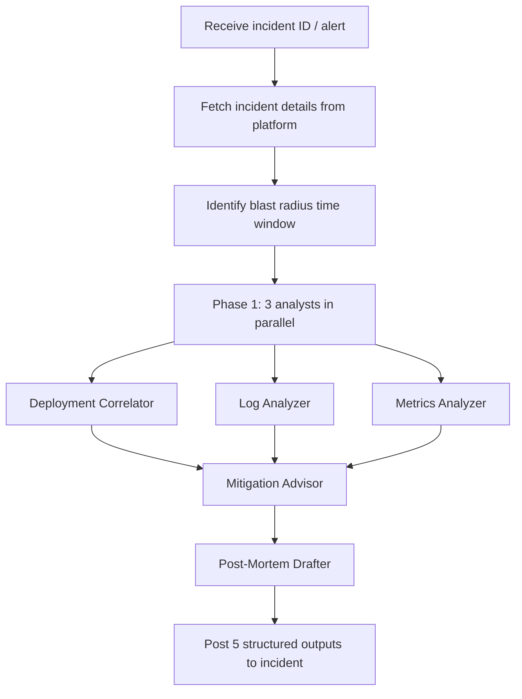

The **Incident Response** plugin acts as an AI first-responder for live incidents. It correlates the incident window with recent deployments, surfaces anomalies from logs and metrics, suggests immediate mitigations, and drafts a post-mortem timeline — so your team can focus on resolving the incident, not reconstructing it.

Works with **Azure DevOps Work Items**, **GitHub Issues**, or plain text input.

---

## What You Get Back

Each run produces five structured outputs posted directly on the incident item — one comment per finding, the original description is never modified:

| # | Output | Description |
|---|---|---|
| 1 | 🚨 Incident Summary | Severity, affected services, blast radius window, status signal |
| 2 | 🚀 Deployment Correlation | Recent deployments within the incident window; each flagged as likely-cause / possible-cause / unrelated |
| 3 | 📊 Logs & Metrics Analysis | Error spikes, latency degradation, anomaly timestamps surfaced from Azure Monitor |
| 4 | 🛠️ Mitigation Suggestions | Immediate actions, rollback candidates, config change hints, blast radius containment |
| 5 | 📝 Post-Mortem Draft | Chronological timeline of events, contributing factors, action items |

A status signal is applied as a tag/label on the incident item:

| Signal | Meaning |
|---|---|
| `investigating` | Correlation found; root cause not yet confirmed |
| `resolved` | Root cause identified and mitigation confirmed |
| `needs-data` | Insufficient signal — the output lists what data is missing |

Sections with no real findings are skipped, never filled with "None identified."

---

## How It Works



1. **Fetch incident** — pulls the work item from Azure DevOps (REST API), GitHub issue, or pasted text. Extracts severity, start time, affected service(s), and any description the team has already written.
2. **Identify time window** — computes a blast radius window ending at incident start time and extending back by `INCIDENT_WINDOW_HOURS` (default: 2 hours). All subsequent queries use this window.
3. **Phase 1 (parallel)** — three analysts run simultaneously:
   - **Deployment Correlator** — queries ADO Release / Pipeline history or GitHub Actions runs for any deployments that touched the affected services within the blast radius window. Each deployment is tagged as `likely-cause`, `possible-cause`, or `unrelated` based on timing and service overlap.
   - **Log Analyzer** — runs KQL queries against Azure Monitor Log Analytics (`az monitor log-analytics query`) targeting error counts, exception traces, and latency anomalies within the window.
   - **Metrics Analyzer** — reads a metrics snapshot (JSON export or `az monitor metrics list` output) and identifies deviations from baseline for error rate, latency P95/P99, and saturation.
4. **Mitigation Advisor** — synthesises Phase 1 output and suggests concrete next steps: rollback candidates (with deployment IDs), config changes, hotfix hints, and blast radius containment actions.
5. **Post-Mortem Drafter** — builds a chronological timeline from all findings, drafts contributing factors, and lists action items as discussion prompts for the team.
6. **Post outputs** — five ordered comments on the incident item. For unsupported platforms, output is written to `incident-response-report.md`.

---

## Inputs

| Input | Source | Required | Description |
|---|---|---|---|
| Repository URL | Agent rule | Yes | The repository containing deployment history — provided by the Xianix Agent rule, not typed in the prompt |
| Incident ID / URL | Prompt | Yes | ADO work item ID, GitHub issue number, or full item URL (e.g. `4821`) |
| Blast radius window | `INCIDENT_WINDOW_HOURS` env var | No | Hours before incident start to search for deployments (default: 2) |
| Metrics snapshot | `METRICS_SOURCE` env var | No | Path to a JSON file exported from `az monitor metrics list` |

The platform (Azure DevOps, GitHub, etc.) is **auto-detected** from `git remote` — you don't need to specify it.

---

## Sample Prompts

```text
/incident-response 4821
```

```text
/incident-response INC-4821
```

```text
/incident-response https://dev.azure.com/org/project/_workitems/edit/4821
```

---

## Environment Variables

| Variable | Platform | Required | Purpose |
|---|---|---|---|
| `AZURE_DEVOPS_TOKEN` | Azure DevOps | Yes | PAT for work items, build, and release pipeline API |
| `GITHUB_TOKEN` | GitHub | Yes | Authenticate `gh` CLI for issues and Actions API |
| `ACTIONS_TOKEN` | GitHub Actions | Optional | Separate token if Actions API needs elevated scope |
| `AZURE_CLIENT_ID` | Azure Monitor | Yes (for logs) | Service principal client ID for `az` CLI authentication |
| `AZURE_CLIENT_SECRET` | Azure Monitor | Yes (for logs) | Service principal secret |
| `AZURE_TENANT_ID` | Azure Monitor | Yes (for logs) | Azure AD tenant ID |
| `LOG_ANALYTICS_WORKSPACE_ID` | Azure Monitor | Yes (for logs) | Log Analytics workspace ID to query |
| `INCIDENT_WINDOW_HOURS` | All | No | Blast radius window in hours (default: 2) |
| `METRICS_SOURCE` | All | No | Path to metrics JSON snapshot file |

:::tip
For local use, `az login` can replace `AZURE_CLIENT_ID`, `AZURE_CLIENT_SECRET`, and `AZURE_TENANT_ID`. For CI/CD pipelines, the service principal approach is recommended.
:::

### Service Principal Minimum Permissions

| Role | Scope | Purpose |
|---|---|---|
| Log Analytics Reader | Log Analytics Workspace | Run `az monitor log-analytics query` |
| Monitoring Reader | Resource Group / Subscription | Read metrics via `az monitor metrics list` |

---

## Quick Start

```bash
# Point Claude Code at the plugin
claude --plugin-dir /path/to/xianix-plugins-official/plugins/incident-response

# Then in the chat
/incident-response 4821
```

See `docs/platform-config.md` for full credential setup and `docs/incident-sources.md` for how to configure log and metrics sources.

Or trigger it automatically via the Xianix Agent by adding a rule — see the examples below and the [Rules Configuration](/agent-configuration/rules/) guide.

---

## Rule Examples

Add one (or both) of the execution blocks below to your `rules.json` so the Xianix Agent automatically kicks off incident response when a webhook fires.

### When does the agent trigger?

The Incident Response Agent is **tag-driven**. It runs when the `ai-dlc/incident/respond` label (GitHub) or tag (Azure DevOps) is present and one of the following happens (OR logic across `match-any` entries):

| Scenario | What it covers |
|---|---|
| Tag newly applied | A human (or on-call automation) adds `ai-dlc/incident/respond` to an existing incident item |
| Item created with tag already present | The incident is opened with the tag included from the start |

| Platform | Scenario | Webhook event | Filter rule |
|---|---|---|---|
| GitHub | Tag newly applied | `issues` | `action==labeled` and the just-added `label.name=='ai-dlc/incident/respond'` |
| GitHub | Issue opened with tag | `issues` | `action==opened` and `ai-dlc/incident/respond` is in `issue.labels` |
| Azure DevOps | Tag newly applied | `workitem.updated` | `ai-dlc/incident/respond` appears in new `System.Tags` but not in `oldValue` |
| Azure DevOps | Work item created with tag | `workitem.created` | `ai-dlc/incident/respond` is in `resource.fields["System.Tags"]` |

### GitHub

```json
{
  "name": "github-issue-incident-response",
  "match-any": [
    {
      "name": "github-issue-tag-applied",
      "rule": "action==labeled&&label.name=='ai-dlc/incident/respond'"
    },
    {
      "name": "github-issue-opened-with-tag",
      "rule": "action==opened&&issue.labels.*.name=='ai-dlc/incident/respond'"
    }
  ],
  "use-inputs": [
    { "name": "issue-number",    "value": "issue.number" },
    { "name": "repository-url",  "value": "repository.clone_url" },
    { "name": "repository-name", "value": "repository.full_name" },
    { "name": "issue-title",     "value": "issue.title" },
    { "name": "platform",        "value": "github", "constant": true }
  ],
  "use-plugins": [
    {
      "plugin-name": "incident-response@xianix-plugins-official",
      "marketplace": "xianix-team/plugins-official"
    }
  ],
  "execute-prompt": "Issue #{{issue-number}} titled \"{{issue-title}}\" in {{repository-name}} has been tagged with `ai-dlc/incident/respond`.\n\nRun /incident-response {{issue-number}} to begin automated incident investigation."
}
```

### Azure DevOps

```json
{
  "name": "azuredevops-workitem-incident-response",
  "match-any": [
    {
      "name": "azuredevops-workitem-tag-applied",
      "rule": "eventType==workitem.updated&&resource.revision.fields.\"System.Tags\"*='ai-dlc/incident/respond'&&resource.fields.\"System.Tags\".oldValue!*='ai-dlc/incident/respond'"
    },
    {
      "name": "azuredevops-workitem-created-with-tag",
      "rule": "eventType==workitem.created&&resource.fields.\"System.Tags\"*='ai-dlc/incident/respond'"
    }
  ],
  "use-inputs": [
    { "name": "workitem-id",     "value": "resource.workItemId" },
    { "name": "workitem-title",  "value": "resource.revision.fields.\"System.Title\"" },
    { "name": "workitem-type",   "value": "resource.revision.fields.\"System.WorkItemType\"" },
    { "name": "project-name",    "value": "resource.revision.fields.\"System.TeamProject\"" },
    { "name": "repository-url",  "value": "https://org@dev.azure.com/org/Project/_git/Repo", "constant": true },
    { "name": "platform",        "value": "azuredevops", "constant": true }
  ],
  "use-plugins": [
    {
      "plugin-name": "incident-response@xianix-plugins-official",
      "marketplace": "xianix-team/plugins-official"
    }
  ],
  "execute-prompt": "Work item ({{workitem-type}}) #{{workitem-id}} titled \"{{workitem-title}}\" in project {{project-name}} has been tagged with `ai-dlc/incident/respond`.\n\nRun /incident-response {{workitem-id}} to begin automated incident investigation."
}
```

:::note
These blocks go inside the `executions` array of a rule set. See [Rules Configuration](/agent-configuration/rules/) for the full file structure and filter syntax.
:::
