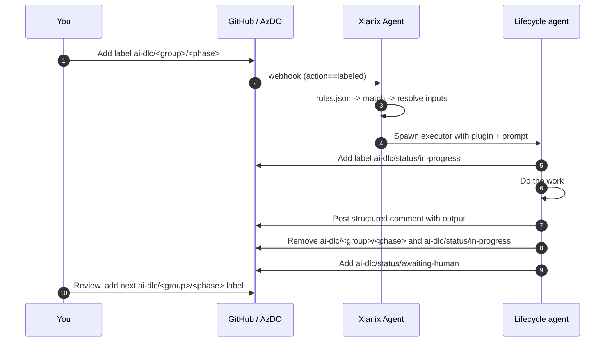
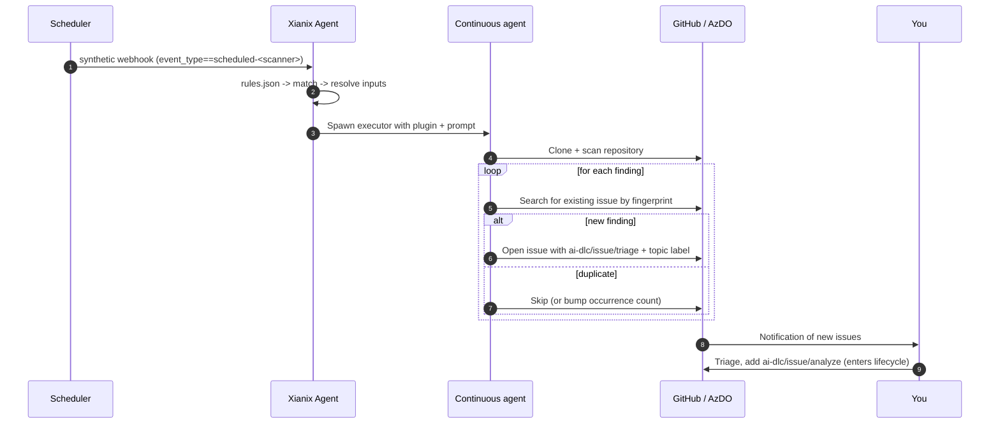

The **Xianix Plugins Official** marketplace is a curated set of AI agents and plugins for a human-led **AI Development Lifecycle (AI-DLC)**. Teams can start small with one or two low-friction agents, then add more structure only where it helps. Every action is initiated by a human applying a label or tag — agents do the heavy lifting, never silently.

The best starting point is the [Adoption Guide](./adoption-guide), which explains how to roll out AI-DLC without introducing a second rigid delivery process. This page is the shared system reference: the marketplace map, the `ai-dlc/*` label vocabulary, the continuous-review scanners, and the common agent contracts.

:::caution[Trust before you install]
Make sure you trust a plugin before installing, updating, or using it. 99x does not control what MCP servers, files, or other software are included in community plugins and cannot verify that they will work as intended or that they won't change.
:::

---

## Start here

Pick the entry point that matches what you want to do:

| If you want to… | Read this |
| --- | --- |
| Start with the simplest rollout path | [Adoption Guide](./adoption-guide) — which agents to enable first, which ones are best for boring work, and how to keep AI-DLC lightweight. |
| Understand the shared AI-DLC language and system behavior | [The shared language](#the-shared-language-ai-dlc-labels) and [Agent contracts](#agent-contracts) on this page. |
| Know what happens on **issues / work items** before any code is written | [Issue Lifecycle](./issue-lifecycle) — the optional issue-phase flow for backlog grooming, design, planning, and implementation support. |
| Know what happens on **pull requests** after implementation starts | [PR Lifecycle](./pr-lifecycle) — per-agent triggers, activities, and outputs for review, AC verification, and tidy-up work before or after merge. |
| Use a single plugin standalone | The [individual plugin pages](#individual-plugins) below. |
| Install the marketplace and start triggering agents | [Adding this marketplace](#adding-this-marketplace) -> [Installing a plugin](#installing-a-plugin). |

---

## What's in the marketplace

### Core docs

These pages describe the marketplace from different angles:

| Page | What it covers |
| --- | --- |
| [Adoption Guide](./adoption-guide) | Recommended rollout path for product teams that want AI help without adding a second rigid process. Starts with review support and boring maintenance work, then layers in more structure only when needed. |
| [Marketplace Overview](./overview) | Shared lifecycle reference: labels, contracts, scanners, install path, and how the pieces fit together. |
| [Issue Lifecycle](./issue-lifecycle) | Deep dive on the optional issue-phase agents (`req-analyst`, `ac-writer`, `solution-architect`, `task-planner`, `implementer`, `bug-triager`, `postmortem-writer`) with platform-specific triggers for GitHub and Azure DevOps. |
| [PR Lifecycle](./pr-lifecycle) | Deep dive on the PR-phase agents (`pr-reviewer`, `ac-verifier`, `comment-resolver`, `test-author`, `doc-writer`) — including review support and tidy-up work before merge versus post-merge. |

### Individual plugins

Each plugin can be installed and triggered on its own. The reference pages document the inputs, prompts, and rule examples you'll need to wire them up.

| Plugin | Description |
| --- | --- |
| [PR Reviewer](./pr-reviewer) | Parallel code-quality, security, test, and performance review — posted straight to your PR. Powers the `pr-reviewer` agent in AI-DLC. |
| [Requirement Analyst](./req-analyst) | Multi-phase requirement grooming: intent, domain, journeys, personas, and gap analysis. Powers the `req-analyst` agent in AI-DLC. |
| [Incident Response](./incident-response) | AI first-responder for live incidents: deployment correlation, log and metrics analysis, mitigation suggestions, and post-mortem drafting. |

---

## Two classes of agents

The marketplace splits cleanly along one axis: **who decides when an agent runs.**

- **Lifecycle agents** wait for *you* to apply a label.
- **Continuous-review agents** run on a schedule, find problems on their own, and feed their findings back into the lifecycle as already-labelled issues.

For the recommended rollout order and the grouping into core adoption, maintenance, and advanced planning agents, start with the [Adoption Guide](./adoption-guide).

---

## The shared language: `ai-dlc/*` labels

If the agents are the team, the `ai-dlc/*` labels are the **baton** they pass between each other and to you. The same vocabulary works on **GitHub labels** and **Azure DevOps tags**, so a workflow you set up on one platform behaves identically on the other.

Labels are organised into four namespaces, each with a clear purpose:

| Namespace | Purpose | Glob |
| --- | --- | --- |
| `ai-dlc/issue/*` | Triggers that act on **issues / work items** | `ai-dlc/issue/*` |
| `ai-dlc/pr/*` | Triggers that act on **pull requests** | `ai-dlc/pr/*` |
| `ai-dlc/status/*` | State **set by agents** so you can see what's going on | `ai-dlc/status/*` |
| `ai-dlc/mod/*` | **Modifiers** that change how an agent runs | `ai-dlc/mod/*` |

This means a single glob — for example `label:"ai-dlc/pr/*"` on GitHub or the equivalent tag filter on Azure DevOps — selects every PR-phase trigger in one go.

| Namespace | Label | Meaning |
| --- | --- | --- |
| `ai-dlc/issue/*` | `ai-dlc/issue/analyze` | Elaborate this raw idea into structured requirements |
| | `ai-dlc/issue/write-ac` | Turn requirements into Gherkin acceptance criteria |
| | `ai-dlc/issue/design` | Propose a solution design (ADR) |
| | `ai-dlc/issue/plan` | Break this epic into child issues |
| | `ai-dlc/issue/implement` | Open a draft PR that implements this |
| | `ai-dlc/issue/triage` | Classify and route this incoming bug |
| | `ai-dlc/issue/postmortem` | Draft a postmortem for this incident |
| `ai-dlc/pr/*` | `ai-dlc/pr/pr-review` | Run a full code review on this PR |
| | `ai-dlc/pr/verify-ac` | Cross-check this PR against the linked issue's Gherkin AC; posts a pass / fail / uncovered table (read-only, no commits) |
| | `ai-dlc/pr/address-comments` | Apply the requested changes from unresolved review comments and push commits. Pre-merge -> commits to the PR branch; post-merge -> opens a follow-up PR |
| | `ai-dlc/pr/improve-tests` | Improve or extend tests on this PR (coverage gaps, edge cases). Works **before merge** (commits to the PR branch) **or after merge** (opens a follow-up PR). Implementation is expected to include baseline tests, especially with TDD |
| | `ai-dlc/pr/update-docs` | Update `Docs/` and READMEs on this PR's branch. Works **before merge** (commits to the PR branch) **or after merge** (opens a follow-up PR). **May be applied together with `ai-dlc/pr/improve-tests`** — both agents commit independently |
| `ai-dlc/status/*` | `ai-dlc/status/in-progress` | An agent is currently running |
| | `ai-dlc/status/awaiting-human` | An agent is done; your move |
| | `ai-dlc/status/blocked` | An agent needs your input to continue |
| | `ai-dlc/status/done` | Pipeline complete for this artifact |
| `ai-dlc/mod/*` | `ai-dlc/mod/force` | Bypass safety checks (for example, self-review block) |
| | `ai-dlc/mod/dry-run` | Show what would happen without making writes |

:::note[Label = consent]
An agent only acts when **you** apply its trigger label. Removing the label is the agent's signal that it has finished. This makes the entire system auditable — every action by an AI is preceded by a human label change.
:::

---

## Continuous-review agents

These agents do not wait for you. They run on a schedule (or on every push to `main`), scan the repository, and turn every finding into a labelled issue or auto-PR. Findings are de-duplicated by a stable fingerprint embedded in each issue body, so reruns do not spam.

| Agent | Suggested cadence | What it watches | How it escalates |
| --- | --- | --- | --- |
| `security-scanner` | nightly + on push to main | Source, dependencies, IaC, secrets | Issue with `security` + `ai-dlc/issue/triage` |
| `performance-scanner` | weekly | Hot paths, N+1 queries, bundle size | Issue with `performance` + `ai-dlc/issue/triage` |
| `test-coverage-scanner` | nightly | Uncovered branches, missing edge cases | Issue with `testing` + `ai-dlc/issue/triage`, or auto-PR with `ai-dlc/pr/pr-review` |
| `dependency-scanner` | daily | Outdated packages, deprecated APIs, CVEs | Auto-PR with `ai-dlc/pr/pr-review` for safe bumps; issue otherwise |
| `dead-code-scanner` | weekly | Unreferenced symbols, unused exports | Issue with `cleanup` + `ai-dlc/issue/triage` |
| `doc-drift-scanner` | weekly | Docs out of sync with code | Issue with `docs` + `ai-dlc/issue/triage` |
| `flaky-test-scanner` | continuous (CI hook) | Tests that fail intermittently | Issue with `flaky` + `ai-dlc/issue/triage` |

:::tip[Continuous -> Lifecycle handoff]
When a scanner opens an issue with `ai-dlc/issue/triage`, the `bug-triager` lifecycle agent picks it up. From there it becomes normal human-led lifecycle work.
:::

---

## Agent contracts

Every agent follows one of two common contracts.

### Lifecycle agent contract



### Continuous-review agent contract



---

## Adding this marketplace

```bash
claude plugin marketplace add xianix-team/xianix-plugins-official
```

Pin to a branch or tag:

```bash
claude plugin marketplace add xianix-team/xianix-plugins-official@main
```

---

## Installing a plugin

Once the marketplace is added:

```bash
/plugin install {plugin-name}@xianix-plugins-official
```

Or browse via `/plugin > Discover`.

---

## Getting started

1. Start with the [Adoption Guide](./adoption-guide) and pick one low-friction entry point, usually `ai-dlc/pr/pr-review`.
2. Seed the labels in your target repository so the agents have something to react to.
3. Wire up the rules in [`rules.json`](/agent-configuration/rules/) so label or tag changes trigger the right agents.
4. Add issue-phase structure only when the team wants more help with ambiguity, planning, or decomposition.
5. Schedule the continuous scanners only after you have tuned their thresholds so they reduce toil instead of creating noise.

:::caution[Trust before you ship]
These agents can write code, open PRs, and create issues in your repository. Treat the `GITHUB_TOKEN` / `AZURE_DEVOPS_TOKEN` you give them the same way you would treat a powerful new teammate's credentials — start with a low-stakes repo, watch a few cycles, then expand.
:::

---

## See also

- [Adoption Guide](./adoption-guide) — start here if you want the simplest rollout path.
- [Issue Lifecycle](./issue-lifecycle) — the deep dive on the issue-phase agents.
- [PR Lifecycle](./pr-lifecycle) — the deep dive on the PR-phase agents.
- [Rules Configuration](/agent-configuration/rules/) — how to wire plugins to webhook events so they trigger automatically.
- [GitHub Setup](/agent-configuration/github/) and [Azure DevOps Setup](/agent-configuration/azure-devops/) — platform-specific webhook setup.
