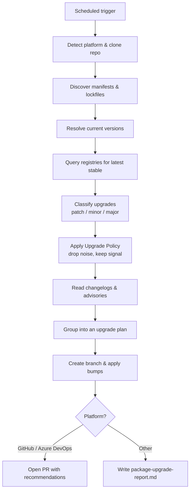

The **Package Dependency Upgrade Agent** plugin runs on a schedule, analyzes the repository's dependency manifests and lockfiles, applies a configurable **upgrade policy** to decide which bumps are worth proposing, and opens a single consolidated pull request only when there are meaningful changes. By default it favours security fixes, EOL migrations, and low-risk patch/minor bumps on runtime dependencies, and defers everything else.

| Analyzer | What it looks for |
|---|---|
| **Dependency Freshness** | Outdated direct and transitive dependencies, latest stable versions, EOL releases |
| **Framework Versions** | Major/minor upgrades available for frameworks (e.g. Node, .NET, Spring, Django, React, Angular) |
| **Security Advisories** | Known CVEs in pinned versions that are fixed in newer releases |
| **Breaking Changes** | Release notes and migration impact for each recommended bump |

Works with **GitHub**, **Azure DevOps**, **Bitbucket**, and any generic git repository. Supports `npm`, `pnpm`, `yarn`, `pip`, `poetry`, `uv`, `maven`, `gradle`, `nuget`, `go mod`, `cargo`, `bundler`, and `composer`.

---

## How It Works



1. **Scheduled trigger** — a cron / synthetic webhook fires (e.g. weekly) and the Xianix Agent spawns the plugin.
2. **Discover manifests** — the plugin walks the repo and identifies every ecosystem in use (`package.json`, `requirements.txt`, `pyproject.toml`, `pom.xml`, `build.gradle`, `*.csproj`, `go.mod`, `Cargo.toml`, `Gemfile`, `composer.json`, etc.).
3. **Resolve current versions** — reads lockfiles to pin the exact version of each dependency, including transitive ones where relevant.
4. **Query registries** — looks up the latest stable version for each dependency and compares against what is pinned.
5. **Classify upgrades** — tags each recommendation as **patch**, **minor**, or **major**, and flags anything with an open CVE.
6. **Apply upgrade policy** — filters the candidate list against the [default policy](#upgrade-policy) and any overrides in `.package-upgrade.yml` (see [Configuration](#configuration)). Candidates are dropped if they fail a policy rule (soak period, cooldown, scope, ignore list, etc.) so the agent only advances *meaningful* upgrades.
7. **Summarize impact** — fetches release notes / changelogs for the surviving bumps and highlights breaking changes and required migration steps.
8. **Open PR** — creates a dedicated branch, applies safe bumps (patch / minor by default), commits manifest + lockfile changes, and opens a PR with the full upgrade plan. Major bumps are listed in the PR body as *recommendations* with migration notes rather than applied automatically, unless `--include-major` is set.
9. **Fallback** — on unsupported platforms, the plan is written to `package-upgrade-report.md` instead.

---

## Upgrade Policy

The agent's goal is to propose **meaningful** upgrades, not every upgrade. Each candidate is evaluated against the following default policy. Anything that fails a rule is dropped from the PR and listed in the PR body under **Deferred** with the reason, so the decision is auditable.

| Signal | Default behaviour | Rationale |
|---|---|---|
| Open CVE (CVSS ≥ 7.0, or EPSS ≥ 0.1) fixed in newer version | **Always propose**, regardless of other filters | Security trumps noise concerns |
| Package is end-of-life / deprecated | Propose with a migration note | EOL is a latent incident |
| Patch bump on a direct runtime dependency | Propose | Low-risk, high-signal |
| Minor bump on a direct runtime dependency | Propose if release is ≥ 7 days old | Avoid bleeding-edge regressions |
| Major bump on a direct runtime dependency | **Only list as recommendation**, don't apply — unless `--include-major` | Requires human migration review |
| Any bump on a dev / test-only dependency | Batch into a monthly PR; skip weekly runs | Low blast radius, not worth weekly churn |
| Transitive-only bump | Skip unless it resolves a CVE | Lockfile noise |
| Pre-release / RC / beta tag | Skip | Not stable |
| Package has < `soak_days` since release (default: 7) | Skip | Avoid bleeding-edge / unvetted releases |
| Same bump proposed and **closed** in the last `cooldown.same_package_days` (default: 30) | Skip | Don't re-litigate upgrades the team already declined |
| Max upgrades per PR exceeded (default: 25) | Split or defer the rest | Keeps PRs reviewable |

:::tip[Cooldown on rejected PRs]
When a team closes (without merging) a PR that bumped package `X` to version `Y`, the agent records the `{package, version}` pair and will not re-propose the same bump for `cooldown.same_package_days`. This is what keeps the agent from nagging — a "no" stays a no for the cooldown window. A newer version of the same package (`Y+1`) is evaluated fresh.
:::

The PR body always contains three sections so reviewers can see what was considered:

- **Proposed** — bumps being applied in this PR.
- **Recommended** — majors / migrations, listed with links to breaking-change notes but not applied.
- **Deferred** — candidates dropped by policy, each annotated with the rule that filtered it (`soak_days`, `cooldown`, `scope: dev`, `ignore`, etc.).

---

## Configuration

The policy above is the default. Teams can override it by committing a `.package-upgrade.yml` file to the repository root. The agent reads this file on every run; missing fields fall back to the defaults.

```yaml
# .package-upgrade.yml
defaults:
  soak_days: 7
  max_upgrades_per_pr: 25
  include_major: false
  include_prereleases: false
  ignore_transitive: true

security:
  min_cvss: 7.0
  always_propose: true

groups:
  - name: runtime-minor-patch
    match: { scope: runtime, bump: [patch, minor] }
    cadence: weekly
  - name: dev-dependencies
    match: { scope: dev }
    cadence: monthly
  - name: majors
    match: { bump: major }
    mode: recommend-only   # list in PR body, don't apply

cooldown:
  same_package_days: 30    # don't re-propose a bump the team already closed

ignore:
  - package: "left-pad"
    reason: "Replaced internally"
  - package: "react"
    versions: ">=19.0.0 <19.1.0"
    reason: "Known perf regression"
```

| Field | Type | Default | Purpose |
|---|---|---|---|
| `defaults.soak_days` | int | `7` | Minimum days since a version was released before the agent will propose it |
| `defaults.max_upgrades_per_pr` | int | `25` | Upper bound on bumps in a single PR; extras are deferred to the next run |
| `defaults.include_major` | bool | `false` | If `true`, majors are applied; otherwise they are only *recommended* |
| `defaults.include_prereleases` | bool | `false` | Allow `-rc`, `-beta`, `-alpha` tags |
| `defaults.ignore_transitive` | bool | `true` | Skip transitive-only bumps unless they fix a CVE |
| `security.min_cvss` | number | `7.0` | Minimum CVSS score for a security-motivated upgrade to bypass other filters |
| `security.always_propose` | bool | `true` | Security upgrades ignore soak period, cooldown, and group cadence |
| `groups[*]` | list | see above | Named groups with their own `match` filter, `cadence`, and `mode` (`apply` / `recommend-only`) |
| `cooldown.same_package_days` | int | `30` | Window during which a closed (non-merged) bump for the same package will not be re-proposed |
| `ignore[*]` | list | `[]` | Packages (optionally version-scoped) the agent must never propose |

:::note
All policy fields can be overridden per-run with the corresponding CLI flags (e.g. `--include-major`, `--security-only`) — the flags take precedence over `.package-upgrade.yml`, which in turn takes precedence over the built-in defaults.
:::

---

## Inputs

| Input | Source | Required | Description |
|---|---|---|---|
| Repository URL | Agent rule | Yes | The repository to analyze — provided by the Xianix Agent rule, not typed in the prompt |
| Ecosystems | Prompt | No | Restrict analysis to a subset (e.g. `npm,pip`). Defaults to all detected ecosystems |
| `--include-major` flag | Prompt | No | Apply major-version bumps in addition to patch/minor (by default, majors are only *recommended*, not applied) |
| `--security-only` flag | Prompt | No | Only propose upgrades that resolve a known CVE |
| `--dry-run` flag | Prompt | No | Produce the report but skip commits and PR creation |

The platform (GitHub, Azure DevOps, etc.) is **auto-detected** from `git remote` — you don't need to specify it.

---

## Sample Prompts

**Run a full scan and open a PR with safe upgrades:**

```text
/package-upgrade-scan
```

**Only propose upgrades for Node and Python:**

```text
/package-upgrade-scan npm,pip
```

**Include major-version bumps and open a PR:**

```text
/package-upgrade-scan --include-major
```

**Only security-motivated upgrades:**

```text
/package-upgrade-scan --security-only
```

**Dry run (report only, no PR):**

```text
/package-upgrade-scan --dry-run
```

---

## Environment Variables

| Variable | Platform | Required | Purpose |
|---|---|---|---|
| `GITHUB_TOKEN` | GitHub | Yes | Authenticate `gh` CLI for creating branches, pushing commits, and opening PRs |
| `AZURE_DEVOPS_TOKEN` | Azure DevOps | Yes | PAT for REST API calls and git push |
| `NPM_TOKEN` | Optional | No | Query private npm registries |
| `PIP_INDEX_URL` | Optional | No | Query private PyPI indexes |

### GitHub Token Permissions

The `GITHUB_TOKEN` requires the following repository permissions:

| Permission | Access | Why it's needed |
|---|---|---|
| **Contents** | Read & Write | Clone the repo, create a branch, and commit manifest/lockfile updates |
| **Metadata** | Read | List collaborators and access repository metadata |
| **Pull requests** | Read & Write | Open the upgrade PR and post the recommendation summary |

---

## Quick Start

```bash
# Point Claude Code at the plugin
claude --plugin-dir /path/to/xianix-plugins-official/plugins/package-dependency-upgrade-agent

# Then in the chat
/package-upgrade-scan
```

Or trigger it automatically via the Xianix Agent by adding a scheduled rule — see the examples below and the [Rules Configuration](/agent-configuration/rules/) guide.

---

## Rule Examples

Add one (or more) of the execution blocks below to your `rules.json` so the Xianix Agent automatically runs the Package Dependency Upgrade Agent on a schedule.

### When does the agent trigger?

The Package Dependency Upgrade Agent is **schedule-driven**. Unlike tag-driven plugins, it does not wait for a human to apply a label — it runs on a cadence you configure (typically weekly) and only escalates by opening a PR when it finds something worth acting on. You can also trigger it manually by dispatching the `scheduled-package-upgrade` event.

| Scenario | What it covers |
|---|---|
| Weekly scheduled run | The default cadence — a synthetic webhook fires and a PR is opened if upgrades are available |
| Manual dispatch | A human (or another rule) fires the `scheduled-package-upgrade` event to force an immediate scan |
| After lockfile changes | Optionally re-run on pushes that touch manifests/lockfiles to catch newly-outdated pins |

There is no label-based trigger for this agent. The cadence (and optional manual dispatch) is the single source of truth for "scan this repo for outdated packages."

| Platform | Scenario | Webhook event | Filter rule |
|---|---|---|---|
| GitHub | Weekly scheduled | `scheduled` | `event_type=='scheduled-package-upgrade'` |
| GitHub | Manual dispatch | `workflow_dispatch` | `inputs.scanner=='package-upgrade'` |
| Azure DevOps | Weekly scheduled | `scheduled` | `event_type=='scheduled-package-upgrade'` |
| Azure DevOps | Manual dispatch | `ms.vss-pipelines.run-state-changed-event` | `resource.pipeline.name=='package-upgrade-scan'` |

### GitHub

```json
{
  "name": "github-package-upgrade-scan",
  "match-any": [
    {
      "name": "github-package-upgrade-scheduled",
      "rule": "event_type=='scheduled-package-upgrade'"
    },
    {
      "name": "github-package-upgrade-manual",
      "rule": "event_type=='workflow_dispatch'&&inputs.scanner=='package-upgrade'"
    }
  ],
  "use-inputs": [
    { "name": "repository-url",  "value": "repository.clone_url" },
    { "name": "repository-name", "value": "repository.full_name" },
    { "name": "default-branch",  "value": "repository.default_branch" },
    { "name": "platform",        "value": "github", "constant": true }
  ],
  "use-plugins": [
    {
      "plugin-name": "package-dependency-upgrade-agent@xianix-plugins-official",
      "marketplace": "xianix-team/plugins-official"
    }
  ],
  "execute-prompt": "You are running the Package Dependency Upgrade Agent on the repository {{repository-name}} (default branch: {{default-branch}}).\n\nRun /package-upgrade-scan to analyze dependencies, propose upgrades, and open a pull request with the recommendations. The `gh` CLI is authenticated and available."
}
```

### Azure DevOps

```json
{
  "name": "azuredevops-package-upgrade-scan",
  "match-any": [
    {
      "name": "azuredevops-package-upgrade-scheduled",
      "rule": "event_type=='scheduled-package-upgrade'"
    },
    {
      "name": "azuredevops-package-upgrade-manual",
      "rule": "eventType=='ms.vss-pipelines.run-state-changed-event'&&resource.pipeline.name=='package-upgrade-scan'"
    }
  ],
  "use-inputs": [
    { "name": "repository-url",  "value": "resource.repository.remoteUrl" },
    { "name": "repository-name", "value": "resource.repository.name" },
    { "name": "default-branch",  "value": "resource.repository.defaultBranch" },
    { "name": "platform",        "value": "azuredevops", "constant": true }
  ],
  "use-plugins": [
    {
      "plugin-name": "package-dependency-upgrade-agent@xianix-plugins-official",
      "marketplace": "xianix-team/plugins-official"
    }
  ],
  "execute-prompt": "You are running the Package Dependency Upgrade Agent on the repository {{repository-name}} (default branch: {{default-branch}}).\n\nRun /package-upgrade-scan to analyze dependencies, propose upgrades, and open a pull request with the recommendations. The `az` CLI is authenticated and available."
}
```

:::note
These blocks go inside the `executions` array of a rule set. See [Rules Configuration](/agent-configuration/rules/) for the full file structure and filter syntax.
:::

:::tip[Pair with PR Reviewer]
The PR that the Package Dependency Upgrade Agent opens is a normal pull request, so it will pick up the `ai-dlc/pr/pr-review` label automatically if your ruleset applies it on new PRs — letting the [PR Reviewer](./pr-reviewer) immediately sanity-check the upgrade before a human reviews it.
:::
