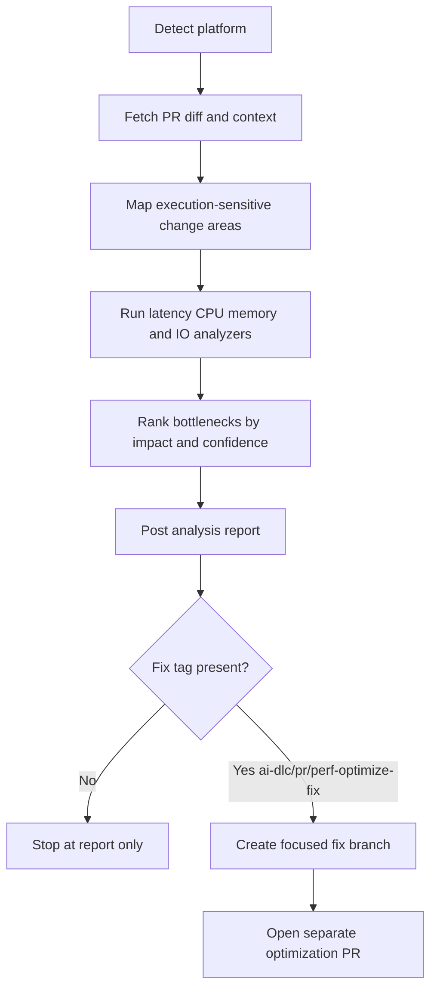

The **Performance Optimizer Agent** analyzes pull requests and branches to identify runtime bottlenecks before they impact users.

It uses a **developer-friendly two-phase model**:

1. **Analysis-first** (`ai-dlc/pr/perf-optimize`) — inspect performance risks and post findings.
2. **Opt-in fix PR** (`ai-dlc/pr/perf-optimize-fix`) — generate a separate optimization PR only when explicitly requested.

It focuses on:

| Capability | What it detects |
|---|---|
| **Latency Bottlenecks** | Slow request paths, expensive synchronous chains, high tail latency patterns |
| **CPU Hotspots** | Costly loops, repeated heavy computation, inefficient algorithms on critical paths |
| **Memory Pressure** | Excess allocations, retention-prone structures, avoidable object churn |
| **I/O and Query Inefficiencies** | N+1 queries, repeated remote calls, blocking I/O, missing batching/caching opportunities |

These capability categories follow common performance engineering practice; thresholds and prioritization are repository-specific and configurable.

Works with **GitHub**, **Azure DevOps**, **Bitbucket**, and any generic git repository.

---

## How It Works



1. **Detect platform** — reads `git remote` to identify GitHub, Azure DevOps, Bitbucket, or generic.
2. **Fetch context** — gathers changed files, recent commits, and probable runtime-critical code paths.
3. **Analyze bottlenecks** — evaluates latency, CPU, memory, and I/O patterns in touched code.
4. **Prioritize impact** — ranks findings by expected performance gain and user-visible effect.
5. **Recommend optimizations** — provides scoped, low-risk improvements and validation guidance.
6. **Publish report** — posts one consolidated result (or saves to `performance-report.md` on unsupported platforms).
7. **Optional fix PR** — if `ai-dlc/pr/perf-optimize-fix` is present, the agent creates a separate optimization PR.

This keeps normal review flow stable while still enabling automated performance improvements when teams opt in.

---

## Inputs

| Input | Source | Required | Description |
|---|---|---|---|
| Repository URL | Agent rule | Yes | The repository to analyze — provided by the Xianix Agent rule |
| PR number | Prompt | No | Analyze a specific pull request (e.g. `123`) |
| Branch name | Prompt | No | Analyze a branch against the default base |
| Scope path | Prompt | No | Restrict analysis to a directory or file pattern |
| Runtime target | Prompt | No | Prioritize API, worker, frontend, or data-layer paths |
| `ai-dlc/pr/perf-optimize` | PR label/tag | No | Trigger analysis-first report mode |
| `ai-dlc/pr/perf-optimize-fix` | PR label/tag | No | Trigger creation of a separate optimization fix PR |

The platform is **auto-detected** from `git remote`.

---

## Sample Prompts

**Analyze the current branch:**

```text
/perf-optimize
```

**Analyze a specific PR:**

```text
/perf-optimize 42
```

**Analyze backend services only:**

```text
/perf-optimize --scope src/services
```

**Analyze and apply safe optimizations:**

```text
/perf-optimize 42
```

**Request a fix PR after analysis:**

```text
Add label/tag: ai-dlc/pr/perf-optimize-fix
```

---

## Report Output

The generated report includes:

- **Top bottlenecks** ranked by likely user impact
- **Latency risk areas** with estimated request-path effect
- **CPU and memory hotspots** with probable causes
- **I/O and query inefficiencies** with concrete rewrite suggestions
- **Optimization backlog** split into quick wins vs deeper follow-up

When fix mode is explicitly requested, the generated optimization PR includes:

- bottleneck summary and reason for change
- scoped code changes for selected low-risk items
- expected impact notes and verification checklist
- links to the source PR and analysis report

Each optimization recommendation includes:

- why the bottleneck matters
- expected performance impact
- suggested implementation boundary
- measurement and validation hints

---

## Environment Variables

| Variable | Platform | Required | Purpose |
|---|---|---|---|
| `GITHUB_TOKEN` | GitHub | Yes | Authenticate `gh` CLI for PR context and comment publishing |
| `AZURE_DEVOPS_TOKEN` | Azure DevOps | Yes | PAT for REST API calls and posting analysis comments |

### GitHub Token Permissions

The `GITHUB_TOKEN` requires:

| Permission | Access | Why it's needed |
|---|---|---|
| **Contents** | Read | Read repository code, branches, and commit history |
| **Metadata** | Read | Resolve repository metadata |
| **Pull requests** | Read & Write | Fetch PR context and post performance findings |

---

## Quick Start

```bash
# Point Claude Code at the plugin
claude --plugin-dir /path/to/xianix-plugins-official/plugins/performance-optimizer-agent

# Then in the chat
/perf-optimize
```

Or trigger it automatically via Xianix Agent rules.

---

## Rule Examples

Use two execution blocks in your `rules.json`:

- **Analysis rule** — runs on `ai-dlc/pr/perf-optimize`
- **Fix PR rule** — runs on `ai-dlc/pr/perf-optimize-fix`

### Trigger behavior

The Performance Optimizer Agent is **tag-driven**:

| Scenario | What it covers |
|---|---|
| Analysis tag applied | Someone adds `ai-dlc/pr/perf-optimize` to an open PR |
| PR opened with analysis tag | PR is created with `ai-dlc/pr/perf-optimize` already present |
| Fix tag applied | Someone adds `ai-dlc/pr/perf-optimize-fix` after reviewing findings |
| New commits to tagged PR | Branch updates while either tag remains |

| Platform | Scenario | Webhook event | Filter rule |
|---|---|---|---|
| GitHub | Tag newly applied | `pull_request` | `action==labeled` and `label.name=='ai-dlc/pr/perf-optimize'` |
| GitHub | PR opened with tag | `pull_request` | `action==opened` and `ai-dlc/pr/perf-optimize` is in `pull_request.labels` |
| GitHub | New commits to tagged PR | `pull_request` | `action==synchronize` and `ai-dlc/pr/perf-optimize` is in `pull_request.labels` |
| GitHub | Fix tag applied | `pull_request` | `action==labeled` and `label.name=='ai-dlc/pr/perf-optimize-fix'` |
| Azure DevOps | Tag newly applied | `git.pullrequest.updated` | `message.text` contains `tagged the pull request` and `ai-dlc/pr/perf-optimize` is in `resource.labels` |
| Azure DevOps | PR created with tag | `git.pullrequest.created` | `ai-dlc/pr/perf-optimize` is in `resource.labels` |
| Azure DevOps | New commits to tagged PR | `git.pullrequest.updated` | `message.text` contains `updated the source branch` and `ai-dlc/pr/perf-optimize` is in `resource.labels` |
| Azure DevOps | Fix tag applied | `git.pullrequest.updated` | `message.text` contains `tagged the pull request` and `ai-dlc/pr/perf-optimize-fix` is in `resource.labels` |

### GitHub Analysis Rule

```json
{
  "name": "github-performance-optimizer-analysis",
  "match-any": [
    {
      "name": "github-pr-tag-applied",
      "rule": "action==labeled&&label.name=='ai-dlc/pr/perf-optimize'"
    },
    {
      "name": "github-pr-opened-with-tag",
      "rule": "action==opened&&pull_request.labels.*.name=='ai-dlc/pr/perf-optimize'"
    },
    {
      "name": "github-pr-synchronize-with-tag",
      "rule": "action==synchronize&&pull_request.labels.*.name=='ai-dlc/pr/perf-optimize'"
    }
  ],
  "use-inputs": [
    { "name": "pr-number",       "value": "number" },
    { "name": "repository-url",  "value": "repository.clone_url" },
    { "name": "repository-name", "value": "repository.full_name" },
    { "name": "pr-title",        "value": "pull_request.title" },
    { "name": "pr-head-branch",  "value": "pull_request.head.ref" },
    { "name": "platform",        "value": "github", "constant": true }
  ],
  "use-plugins": [
    {
      "plugin-name": "performance-optimizer-agent@xianix-plugins-official",
      "marketplace": "xianix-team/plugins-official"
    }
  ],
  "execute-prompt": "You are running an analysis-first performance bottleneck review for pull request #{{pr-number}} titled \"{{pr-title}}\" in repository {{repository-name}} (branch: {{pr-head-branch}}).\n\nRun /perf-optimize and post findings only. Do not create a fix PR unless the opt-in fix tag is present."
}
```

### GitHub Fix PR Rule

```json
{
  "name": "github-performance-optimizer-fix-pr",
  "match-any": [
    {
      "name": "github-pr-fix-tag-applied",
      "rule": "action==labeled&&label.name=='ai-dlc/pr/perf-optimize-fix'"
    }
  ],
  "use-inputs": [
    { "name": "pr-number",       "value": "number" },
    { "name": "repository-url",  "value": "repository.clone_url" },
    { "name": "repository-name", "value": "repository.full_name" },
    { "name": "pr-title",        "value": "pull_request.title" },
    { "name": "pr-head-branch",  "value": "pull_request.head.ref" },
    { "name": "platform",        "value": "github", "constant": true }
  ],
  "use-plugins": [
    {
      "plugin-name": "performance-optimizer-agent@xianix-plugins-official",
      "marketplace": "xianix-team/plugins-official"
    }
  ],
  "execute-prompt": "You are running opt-in fix mode for pull request #{{pr-number}} titled \"{{pr-title}}\" in repository {{repository-name}} (branch: {{pr-head-branch}}).\n\nRun /perf-optimize --fix-pr. Create a separate PR with focused, low-risk performance optimizations and link it to the source PR."
}
```

### Azure DevOps Analysis Rule

```json
{
  "name": "azuredevops-performance-optimizer-analysis",
  "match-any": [
    {
      "name": "azuredevops-pr-tag-applied",
      "rule": "eventType==git.pullrequest.updated&&message.text*='tagged the pull request'&&resource.labels.*.name=='ai-dlc/pr/perf-optimize'"
    },
    {
      "name": "azuredevops-pr-created-with-tag",
      "rule": "eventType==git.pullrequest.created&&resource.labels.*.name=='ai-dlc/pr/perf-optimize'"
    },
    {
      "name": "azuredevops-pr-source-branch-updated-with-tag",
      "rule": "eventType==git.pullrequest.updated&&message.text*='updated the source branch'&&resource.labels.*.name=='ai-dlc/pr/perf-optimize'"
    }
  ],
  "use-inputs": [
    { "name": "pr-number",       "value": "resource.pullRequestId" },
    { "name": "repository-url",  "value": "resource.repository.remoteUrl" },
    { "name": "repository-name", "value": "resource.repository.name" },
    { "name": "pr-title",        "value": "resource.title" },
    { "name": "pr-head-branch",  "value": "resource.sourceRefName" },
    { "name": "platform",        "value": "azuredevops", "constant": true }
  ],
  "use-plugins": [
    {
      "plugin-name": "performance-optimizer-agent@xianix-plugins-official",
      "marketplace": "xianix-team/plugins-official"
    }
  ],
  "execute-prompt": "You are running an analysis-first performance bottleneck review for pull request #{{pr-number}} titled \"{{pr-title}}\" in repository {{repository-name}} (branch: {{pr-head-branch}}).\n\nRun /perf-optimize and post findings only. Do not create a fix PR unless the opt-in fix tag is present."
}
```

### Azure DevOps Fix PR Rule

```json
{
  "name": "azuredevops-performance-optimizer-fix-pr",
  "match-any": [
    {
      "name": "azuredevops-pr-fix-tag-applied",
      "rule": "eventType==git.pullrequest.updated&&message.text*='tagged the pull request'&&resource.labels.*.name=='ai-dlc/pr/perf-optimize-fix'"
    }
  ],
  "use-inputs": [
    { "name": "pr-number",       "value": "resource.pullRequestId" },
    { "name": "repository-url",  "value": "resource.repository.remoteUrl" },
    { "name": "repository-name", "value": "resource.repository.name" },
    { "name": "pr-title",        "value": "resource.title" },
    { "name": "pr-head-branch",  "value": "resource.sourceRefName" },
    { "name": "platform",        "value": "azuredevops", "constant": true }
  ],
  "use-plugins": [
    {
      "plugin-name": "performance-optimizer-agent@xianix-plugins-official",
      "marketplace": "xianix-team/plugins-official"
    }
  ],
  "execute-prompt": "You are running opt-in fix mode for pull request #{{pr-number}} titled \"{{pr-title}}\" in repository {{repository-name}} (branch: {{pr-head-branch}}).\n\nRun /perf-optimize --fix-pr. Create a separate PR with focused, low-risk performance optimizations and link it to the source PR."
}
```

:::note
These blocks belong inside the `executions` array of a rule set. See [Rules Configuration](/agent-configuration/rules/) for full syntax.
:::
