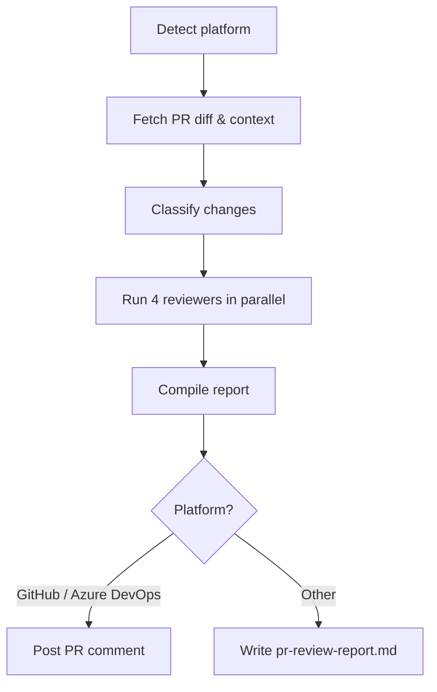

The **PR Reviewer** plugin runs four specialized reviewers in parallel and posts a unified, structured review directly on your pull request.

| Reviewer | What it looks for |
|---|---|
| **Code Quality** | Architecture, patterns, readability, maintainability |
| **Security** | Vulnerabilities, exposed secrets, insecure patterns (OWASP) |
| **Test Coverage** | Missing tests, quality gaps, untested code paths |
| **Performance** | Bottlenecks, algorithmic issues, resource waste |

Works with **GitHub**, **Azure DevOps**, **Bitbucket**, and any generic git repository.

---

## How It Works



1. **Detect platform** — reads `git remote` to identify GitHub, Azure DevOps, Bitbucket, or generic.
2. **Fetch PR context** — gathers the diff, commit log, and changed file list against the base branch.
3. **Classify changes** — determines change type, languages involved, risk level, and scope.
4. **Parallel review** — code-quality, security, test, and performance reviewers run simultaneously.
5. **Compile & post** — findings are merged into a single report and posted as a PR comment (or saved to `pr-review-report.md` for unsupported platforms).

With the `--fix` flag the plugin will also apply fixes, commit, and push.

---

## Inputs

| Input | Source | Required | Description |
|---|---|---|---|
| Repository URL | Agent rule | Yes | The repository to review — provided by the Xianix Agent rule, not typed in the prompt |
| PR number | Prompt | No | Target a specific pull request (e.g. `123`) |
| Branch name | Prompt | No | Compare a branch against the default base |
| `--fix` flag | Prompt | No | Auto-fix issues, commit, and push |

The platform (GitHub, Azure DevOps, etc.) is **auto-detected** from `git remote` — you don't need to specify it.

---

## Sample Prompts

**Review the current branch:**

```text
/pr-review
```

**Review a specific PR:**

```text
/pr-review 42
```

**Review and auto-fix:**

```text
/pr-review 42 --fix
```

---

## Environment Variables

| Variable | Platform | Required | Purpose |
|---|---|---|---|
| `GH_TOKEN` / `GITHUB_TOKEN` | GitHub | Yes | Authenticate `gh` CLI for fetching PR data and posting comments |
| `GIT_TOKEN` | GitHub / Generic | Only with `--fix` | HTTPS push credentials for committing fixes |
| `AZURE_DEVOPS_TOKEN` | Azure DevOps | Yes | PAT for REST API calls and git push |

:::tip
You can export these in your shell or place them in a project-root `.env` file and run `source .env && claude`.
:::

---

## Quick Start

```bash
# Point Claude Code at the plugin
claude --plugin-dir /path/to/xianix-plugins-official/plugins/pr-reviewer

# Then in the chat
/pr-review
```

Or trigger it automatically via the Xianix Agent by adding a rule — see the examples below and the [Rules Configuration](/agent-configuration/rules/) guide.

---

## Rule Examples

Add one (or both) of the execution blocks below to your `rules.json` so the Xianix Agent automatically reviews pull requests when a webhook fires.

### When does the agent trigger?

All triggers require the agent (`xianix-agent`) to be listed as a reviewer on the pull request. The review runs when **any** of the following scenarios match (OR logic across `match-any` entries):

| Platform | Scenario | Webhook event | Filter rule |
|---|---|---|---|
| GitHub | PR opened with agent as reviewer | `pull_request` | `action==opened` and `xianix-agent` in `requested_reviewers` |
| GitHub | New commits pushed to PR branch | `pull_request` | `action==synchronize` and `xianix-agent` in `requested_reviewers` |
| GitHub | Agent requested as reviewer | `pull_request` | `action==review_requested` and `requested_reviewer.login` is `xianix-agent` |
| Azure DevOps | PR created with agent as reviewer | `git.pullrequest.created` | `xianix-agent` in `reviewers` |
| Azure DevOps | Source branch updated | `git.pullrequest.updated` | `xianix-agent` in `reviewers` and message contains "updated the source branch" |
| Azure DevOps | Agent added as reviewer | `git.pullrequest.updated` | `xianix-agent` in `reviewers` and message contains "as a reviewer" |

### GitHub

```json
{
  "name": "github-pull-request-review",
  "match-any": [
    {
      "name": "github-pr-opened-event",
      "rule": "action==opened&&pull_request.requested_reviewers.*.login=='xianix-agent'"
    },
    {
      "name": "github-pr-synchronize-event",
      "rule": "action==synchronize&&pull_request.requested_reviewers.*.login=='xianix-agent'"
    },
    {
      "name": "github-pr-review-requested-event",
      "rule": "action==review_requested&&requested_reviewer.login=='xianix-agent'"
    }
  ],
  "use-inputs": [
    { "name": "pr-number",       "value": "number" },
    { "name": "repository-url",  "value": "repository.clone_url" },
    { "name": "repository-name", "value": "repository.full_name" },
    { "name": "pr-title",        "value": "pull_request.title" },
    { "name": "pr-head-branch",  "value": "pull_request.head.ref" },
    { "name": "platform",        "value": "github", "constant": true }
  ],
  "use-plugins": [
    {
      "plugin-name": "pr-reviewer@xianix-plugins-official",
      "marketplace": "xianix-team/plugins-official",
      "envs": [
        { "name": "GITHUB_PERSONAL_ACCESS_TOKEN", "value": "env.GITHUB_TOKEN" }
      ]
    }
  ],
  "execute-prompt": "You are reviewing pull request #{{pr-number}} titled \"{{pr-title}}\" in the repository {{repository-name}} (branch: {{pr-head-branch}}).\n\nRun /code-review to perform the automated review. The `gh` CLI is authenticated and available if you need it directly."
}
```

### Azure DevOps

```json
{
  "name": "azuredevops-pull-request-review",
  "match-any": [
    {
      "name": "azuredevops-pr-created",
      "rule": "eventType==git.pullrequest.created&&resource.reviewers.*.displayName=='xianix-agent'"
    },
    {
      "name": "azuredevops-pr-source-branch-updated",
      "rule": "eventType==git.pullrequest.updated&&resource.reviewers.*.displayName=='xianix-agent'&&message.text*='updated the source branch'"
    },
    {
      "name": "azuredevops-pr-reviewer-assigned",
      "rule": "eventType==git.pullrequest.updated&&resource.reviewers.*.displayName=='xianix-agent'&&message.text*='as a reviewer'"
    }
  ],
  "use-inputs": [
    { "name": "pr-number",       "value": "resource.pullRequestId" },
    { "name": "repository-url",  "value": "resource.repository.remoteUrl" },
    { "name": "repository-name", "value": "resource.repository.name" },
    { "name": "pr-title",        "value": "resource.title" },
    { "name": "pr-head-branch",  "value": "resource.sourceRefName" },
    { "name": "platform",        "value": "azuredevops", "constant": true }
  ],
  "use-plugins": [
    {
      "plugin-name": "pr-reviewer@xianix-plugins-official",
      "marketplace": "xianix-team/plugins-official"
    }
  ],
  "execute-prompt": "You are reviewing pull request #{{pr-number}} titled \"{{pr-title}}\" in the repository {{repository-name}} (branch: {{pr-head-branch}}).\n\nRun /code-review to perform the automated review. The `az` CLI is authenticated and available if you need it directly."
}
```

:::note
These blocks go inside the `executions` array of a rule set. See [Rules Configuration](/agent-configuration/rules/) for the full file structure and filter syntax.
:::
