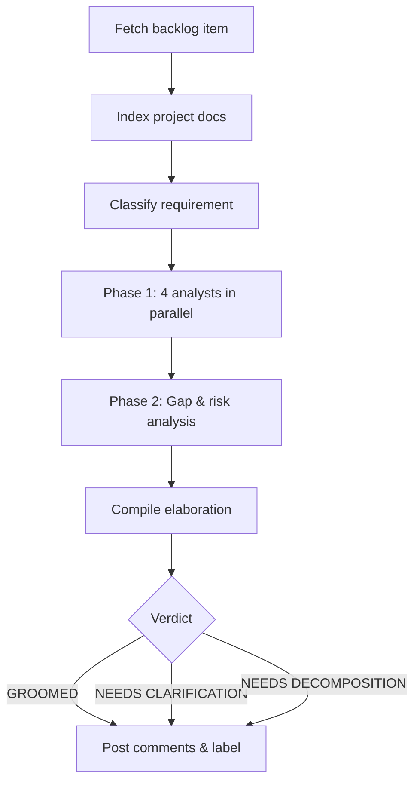

The **Requirement Analyst** plugin grooms backlog items by running five specialized analysts and producing a structured elaboration. It works with **GitHub Issues**, **Azure DevOps Work Items**, or plain text input.

---

## How It Works



1. **Fetch item** — pulls the issue/work-item from GitHub (`gh`) or Azure DevOps (REST API).
2. **Index project context** — scans READMEs, specs, and manifests for a ~500-word project summary.
3. **Classify** — determines type (story / task / bug / spike), domain, and complexity.
4. **Phase 1 (parallel)** — four analysts run simultaneously:
   - **Intent** — what the user really needs and why.
   - **Domain** — relevant domain knowledge, competitive context.
   - **Journey** — maps the user workflow around this requirement.
   - **Persona** — identifies affected user personas.
5. **Phase 2** — a **Gap & Risk** analyst reviews Phase 1 output for missing acceptance criteria, edge cases, and risks.
6. **Compile & post** — findings are formatted and posted as ordered comments on the issue. A verdict label is applied: `GROOMED`, `NEEDS CLARIFICATION`, or `NEEDS DECOMPOSITION`.

For unsupported platforms, the output is written to `requirement-elaboration-report.md`.

---

## Inputs

| Input | Source | Required | Description |
|---|---|---|---|
| Repository URL | Agent rule | Yes | The repository containing the backlog item — provided by the Xianix Agent rule, not typed in the prompt |
| Issue / Work-item number | Prompt | Yes | The backlog item to analyze (e.g. `42`) |

The platform (GitHub, Azure DevOps, etc.) is **auto-detected** from `git remote` — you don't need to specify it.

---

## Sample Prompt

```text
/requirement-analysis 42
```

---

## Environment Variables

| Variable | Platform | Required | Purpose |
|---|---|---|---|
| `GITHUB_TOKEN` | GitHub | Yes | Authenticate `gh` CLI for reading issues and posting comments |
| `AZURE_DEVOPS_TOKEN` | Azure DevOps | Yes | PAT for REST API calls (read work items, post comments) |

:::tip
For CI pipelines, you can also set `PLATFORM`, `REPO_URL`, and `ISSUE_NUMBER` to drive the plugin without interactive input.
:::

---

## Quick Start

```bash
# Point Claude Code at the plugin
claude --plugin-dir /path/to/xianix-plugins-official/plugins/req-analyst

# Then in the chat
/requirement-analysis 42
```

Or trigger it via the Xianix Agent using a webhook rule that fires on new issues — see the [Rules Configuration](/agent-configuration/rules/) guide.
