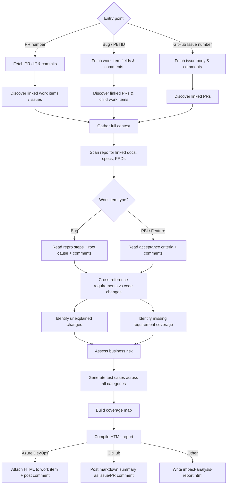

The **Test Strategist** plugin gathers everything needed to understand what was built — work item requirements, code changes across linked pull requests, comments, child items, and referenced documentation — then produces a business-readable HTML report that serves as the testing guide for a QA engineer doing risk-based testing.

Reports are written for **QA engineers, product owners, and non-technical stakeholders**. Test cases describe _what_ to verify and _why it matters_ — not which line of code changed.

| What it produces | Description |
|---|---|
| **Requirements Coverage** | Checks every repro step, acceptance criterion, or feature description against actual code changes |
| **Developer Changes Requiring Clarification** | Highlights code changes that cannot be explained by the stated requirements — flagged for discussion before testing begins |
| **Risk Assessment** | Business-level risk summary — what could break, who is affected, and how severe the impact would be |
| **Functional Test Cases** | Scenario-level cases for happy paths, alternate flows, and boundary conditions, grounded in what the requirement actually asks for |
| **Performance Test Cases** | Load, soak, and concurrency scenarios inferred from the change and any SLOs in the repository — skipped automatically when there is no realistic performance surface |
| **Security Test Cases** | Authorisation boundaries, input validation, injection surfaces, and OWASP-relevant patterns for the touched code paths |
| **Privacy & PII Test Cases** | Personal data handling, consent, retention, deletion paths, logging leakage, and cross-border transfer surfaces |
| **Accessibility & Usability Test Cases** | Keyboard navigation, screen reader semantics, contrast, and error recovery — generated only for UI-touching changes |
| **Resilience Test Cases** | Timeout, retry, partial failure, idempotency, and graceful degradation scenarios for service-touching changes |
| **Compatibility Test Cases** | Browser, OS, device, API version, and integration contract scenarios — generated when the change touches a UI, public API, or shared integration point |
| **Coverage Map** | A matrix linking every requirement, risk, and matched incident to the test cases that cover it — gaps are explicit, not hidden |

Works with **GitHub** (Issues and Features) and **Azure DevOps** (Bugs and PBIs).

---

## How It Works



1. **Accept any entry point** — a PR number, a Bug/PBI ID, or a GitHub Issue number. The plugin resolves the rest automatically.
2. **Discover all linked context** — for a work item, finds linked and child PRs; for a PR, finds the linked work item or issue. Changesets attached to the work item are included.
3. **Enrich with repository documentation** — scans for PRDs, specs, and design notes under common paths (`/docs`, `/specs`, `/requirements`, `/design`) that the work item references.
4. **Read the right fields** — for Bugs: reproduction steps, root cause analysis, and comments; for PBIs and Features: acceptance criteria and comments.
5. **Cross-reference requirements against code** — every code change is matched to a requirement. Changes that cannot be explained are flagged for clarification. Requirements with no corresponding code change are surfaced as gaps.
6. **Assess business risk** — impact is described in terms of user workflows, data integrity, and business outcomes — not file paths or method names.
7. **Generate layered test cases** — functional, performance, security, privacy, accessibility, and resilience scenarios are generated in proportion to the risk profile of the change. Categories with no realistic surface are skipped automatically.
8. **Build a coverage map** — a matrix that makes visible which requirements and risks each test case covers, and which are explicitly out of scope.
9. **Publish** — delivery depends on the platform:
   - **Azure DevOps**: the HTML report is attached as a file to the work item via the REST API, and a brief comment is posted on the work item (and on the PR if triggered from a PR) to notify the team that the report is attached.
   - **GitHub**: GitHub does not support HTML file attachments on issues or pull requests, so a markdown-formatted summary is posted as a comment on the issue or PR instead. The full `impact-analysis-report.html` is also written locally.
   - **Other**: the report is written to `impact-analysis-report.html` in the repository root.

---

## Entry Points

The plugin accepts three entry points. Only one is needed — the agent resolves the rest.

| Entry Point | Example Prompt | What the agent does |
|---|---|---|
| **PR number** | `/test-strategy pr 87` | Fetches the PR diff, then discovers the linked work item or issue to read requirements |
| **Azure DevOps Bug or PBI ID** | `/test-strategy wi 4521` | Fetches the work item fields and comments, then discovers all linked and child PRs |
| **GitHub Issue number** | `/test-strategy issue 203` | Fetches the issue body and comments, then discovers all linked pull requests |

When triggered automatically via a Xianix Agent rule, the entry point is supplied by the webhook payload — no manual input is needed.

---

## Inputs

| Input | Source | Required | Description |
|---|---|---|---|
| Entry point ID | Agent rule or prompt | Yes | PR number, work item ID, or issue number |
| Repository URL | Agent rule | Yes | Used to fetch diffs, linked items, and repository documentation |
| Work item type override | Prompt | No | Force `bug` or `pbi` if auto-detection is ambiguous |
| `--no-perf` flag | Prompt | No | Skip performance test case generation |
| `--no-a11y` flag | Prompt | No | Skip accessibility test case generation |

The platform (GitHub or Azure DevOps) is **auto-detected** from the repository URL — you do not need to specify it.

---

## Sample Prompts

**Analyse the current branch (agent infers PR from active branch):**

```text
/test-strategy
```

**Analyse a specific pull request:**

```text
/test-strategy pr 87
```

**Analyse an Azure DevOps Bug or PBI by work item ID:**

```text
/test-strategy wi 4521
```

**Analyse a GitHub Issue:**

```text
/test-strategy issue 203
```

**Analyse a work item and skip performance tests:**

```text
/test-strategy wi 4521 --no-perf
```

---

## Report Sections

The generated HTML report contains twelve structured sections.

| # | Section | Description |
|---|---|---|
| 1 | **Summary** | Work item or issue title, type, severity/priority, developer, tester, iteration, and all linked PRs |
| 2 | **Context Gathered** | Everything the agent discovered: linked PRs, child work items, changesets, and referenced documentation |
| 3 | **Code Changes Overview** | Per-PR cards with file counts, branch information, and links — without raw diffs |
| 4 | **Requirements Coverage** | Each repro step (Bug) or acceptance criterion (PBI/Feature) mapped to the code changes that address it |
| 5 | **Developer Changes Requiring Clarification** | Code changes not explained by any stated requirement — categorised and flagged for discussion with the developer before testing begins |
| 6 | **Missing Requirement Coverage** | Requirements or acceptance criteria with no corresponding code change found |
| 7 | **Business Risk Assessment** | What could go wrong, who is affected, and how severe — written for non-technical readers |
| 8 | **Test Cases** | All test scenarios across seven categories (see below) |
| 9 | **Coverage Map** | Matrix showing which requirements and risks each test case covers, and what is explicitly out of scope |
| 10 | **Impacted Areas** | Direct and indirect impact on user workflows, integrations, and data — with High / Medium / Low ratings |
| 11 | **Environment & Assignment** | Area path, iteration, assigned developer, assigned tester |
| 12 | **QA Sign-off** | Interactive checklist for the tester to confirm completion |

### Test Case Categories

Test cases are written in plain language. Every scenario includes: what to do, what data to use, and what the expected outcome looks like from a user's perspective. Technical implementation details are intentionally excluded.

| Category | Scope | When generated |
|---|---|---|
| 🟢 **Functional** | Happy paths, alternate flows, and boundary conditions derived from acceptance criteria, repro steps, comments, and linked specification documents | Always |
| 🔵 **Performance** | Load, soak, and concurrency scenarios; latency budgets inferred from requirements and any SLOs in the repository | When the change touches a service, query, or data pipeline with realistic performance exposure |
| 🔴 **Security** | Authorisation and authentication boundaries, input validation, injection surfaces, secrets handling, and OWASP-relevant patterns for the touched paths | When the change touches authentication, data input, API surfaces, or permission logic |
| 🟡 **Privacy & PII** | Personal data flows, consent and purpose-limitation checks, data retention and deletion paths, logging and telemetry leakage, and cross-border transfer surfaces | When the change handles personal, financial, or health data |
| 🟣 **Accessibility & Usability** | Keyboard navigation paths, screen reader semantics, colour contrast, error recovery, and empty/error state behaviour | When the change touches any user interface |
| ⚪ **Resilience** | Timeout handling, retry behaviour, partial failure recovery, idempotency, and graceful degradation | When the change touches a service call, queue, or external dependency |
| 🟤 **Compatibility** | Browser, OS, device, screen size, API version, and third-party integration compatibility — verifies the change does not break existing consumers or supported environments | When the change touches a UI, a public API, an integration point, or a contract shared with other systems |

### Developer Changes Requiring Clarification

Any code change that cannot be mapped to a stated requirement is surfaced in its own section before the test cases, so the tester knows to pause and seek clarification rather than guess scope. Each flagged change includes:

| Field | What it contains |
|---|---|
| **Change** | Plain-language description of what the code does differently |
| **Category** | 🔧 Optimisation · 📊 Query Change · 🧹 Cleanup · 🔄 Refactoring · ➕ Added Functionality · 🔀 Unrelated |
| **Location** | File and area affected |
| **Hypothesis** | What the agent believes the intent is, if it can be inferred |
| **Status** | Needs Clarification — must be resolved before this area is tested |

### Coverage Map

The coverage map is a matrix at the end of the report showing:

- Which acceptance criteria or repro steps each test case covers
- Which identified risks each test case mitigates
- Which items are deliberately marked out of scope (and why)
- Any requirement or risk with no test case — surfaced as a gap

---

## Environment Variables

| Variable | Platform | Required | Purpose |
|---|---|---|---|
| `AZURE_DEVOPS_TOKEN` | Azure DevOps | Yes | PAT for REST API — fetches work items, PRs, changesets, and posts the report comment |
| `GITHUB_TOKEN` | GitHub | Yes | Authenticate `gh` CLI for fetching issues, PRs, and posting comments |

### Azure DevOps Token Permissions

| Permission | Access | Why it's needed |
|---|---|---|
| **Work Items** | Read & Write | Fetch fields, repro steps, acceptance criteria, root cause, and comments; post the report |
| **Code** | Read | Access PR diffs, file history, commit details, and changesets |
| **Pull Requests** | Read | Fetch PR metadata and navigate work item ↔ PR links |

### GitHub Token Permissions

| Permission | Access | Why it's needed |
|---|---|---|
| **Contents** | Read | Access repository contents, commits, and documentation files |
| **Metadata** | Read | Search repositories and access repository metadata |
| **Issues** | Read | Fetch issue body, labels, and comments |
| **Pull requests** | Read & Write | Fetch PR diffs, navigate issue ↔ PR links, and post the report comment |

---

## Quick Start

```bash
# Point Claude Code at the plugin
claude --plugin-dir /path/to/xianix-plugins-official/plugins/test-strategist

# Then in the chat — start from a PR, a work item, or a GitHub issue
/test-strategy pr 87
/test-strategy wi 4521
/test-strategy issue 203
```

Or trigger it automatically via the Xianix Agent by adding a rule — see the examples below and the [Rules Configuration](/agent-configuration/rules/) guide.

---

## Rule Examples

The Test Strategist supports **two independent trigger paths** on both platforms:

- **PR-based trigger** — tag a pull request with `ai-dlc/pr/test-strategy` to analyse from the PR inward to the linked work item or issue.
- **Work item / issue trigger** — tag a Bug, PBI, or GitHub Issue with `ai-dlc/wi/test-strategy` to analyse from the requirement outward across all linked PRs.

Both paths produce the same report. Choose whichever fits your team's workflow, or use both.

### When does the agent trigger?

| Platform | Entry point | Scenario | Webhook event | Filter rule |
|---|---|---|---|---|
| GitHub | PR | Tag newly applied | `pull_request` | `action==labeled` and `label.name=='ai-dlc/pr/test-strategy'` |
| GitHub | PR | PR opened with tag | `pull_request` | `action==opened` and `ai-dlc/pr/test-strategy` is in `pull_request.labels` |
| GitHub | PR | New commits to tagged PR | `pull_request` | `action==synchronize` and `ai-dlc/pr/test-strategy` is in `pull_request.labels` |
| GitHub | Issue | Tag newly applied | `issues` | `action==labeled` and `label.name=='ai-dlc/wi/test-strategy'` |
| GitHub | Issue | Issue closed with tag | `issues` | `action==closed` and `ai-dlc/wi/test-strategy` is in `issue.labels` |
| Azure DevOps | PR | Tag newly applied | `git.pullrequest.updated` | `message.text` contains `tagged the pull request` and `ai-dlc/pr/test-strategy` is in `resource.labels` |
| Azure DevOps | PR | PR created with tag | `git.pullrequest.created` | `ai-dlc/pr/test-strategy` is in `resource.labels` |
| Azure DevOps | PR | New commits to tagged PR | `git.pullrequest.updated` | `message.text` contains `updated the source branch` and `ai-dlc/pr/test-strategy` is in `resource.labels` |
| Azure DevOps | Work item | Tag newly applied | `workitem.updated` | `message.text` contains `tagged the work item` and `ai-dlc/wi/test-strategy` is in `resource.labels` |
| Azure DevOps | Work item | Work item resolved | `workitem.resolved` | `ai-dlc/wi/test-strategy` is in `resource.labels` |

---

### GitHub — PR trigger

```json
{
  "name": "github-pull-request-test-strategy",
  "match-any": [
    {
      "name": "github-pr-tag-applied",
      "rule": "action==labeled&&label.name=='ai-dlc/pr/test-strategy'"
    },
    {
      "name": "github-pr-opened-with-tag",
      "rule": "action==opened&&pull_request.labels.*.name=='ai-dlc/pr/test-strategy'"
    },
    {
      "name": "github-pr-synchronize-with-tag",
      "rule": "action==synchronize&&pull_request.labels.*.name=='ai-dlc/pr/test-strategy'"
    }
  ],
  "use-inputs": [
    { "name": "pr-number",       "value": "number" },
    { "name": "repository-url",  "value": "repository.clone_url" },
    { "name": "repository-name", "value": "repository.full_name" },
    { "name": "pr-title",        "value": "pull_request.title" },
    { "name": "pr-head-branch",  "value": "pull_request.head.ref" },
    { "name": "entry-type",      "value": "pr",     "constant": true },
    { "name": "platform",        "value": "github", "constant": true }
  ],
  "use-plugins": [
    {
      "plugin-name": "test-strategist@xianix-plugins-official",
      "marketplace": "xianix-team/plugins-official"
    }
  ],
  "execute-prompt": "You are generating a risk-based test strategy for pull request #{{pr-number}} titled \"{{pr-title}}\" in the repository {{repository-name}} (branch: {{pr-head-branch}}).\n\nRun /test-strategy pr {{pr-number}} to generate the impact analysis and test strategy report. The `gh` CLI is authenticated and available if you need it directly."
}
```

### GitHub — Issue trigger

```json
{
  "name": "github-issue-test-strategy",
  "match-any": [
    {
      "name": "github-issue-tag-applied",
      "rule": "action==labeled&&label.name=='ai-dlc/wi/test-strategy'"
    },
    {
      "name": "github-issue-closed-with-tag",
      "rule": "action==closed&&issue.labels.*.name=='ai-dlc/wi/test-strategy'"
    }
  ],
  "use-inputs": [
    { "name": "issue-number",    "value": "issue.number" },
    { "name": "repository-url",  "value": "repository.clone_url" },
    { "name": "repository-name", "value": "repository.full_name" },
    { "name": "issue-title",     "value": "issue.title" },
    { "name": "entry-type",      "value": "issue",  "constant": true },
    { "name": "platform",        "value": "github", "constant": true }
  ],
  "use-plugins": [
    {
      "plugin-name": "test-strategist@xianix-plugins-official",
      "marketplace": "xianix-team/plugins-official"
    }
  ],
  "execute-prompt": "You are generating a risk-based test strategy for issue #{{issue-number}} titled \"{{issue-title}}\" in the repository {{repository-name}}.\n\nRun /test-strategy issue {{issue-number}} to generate the impact analysis and test strategy report. The `gh` CLI is authenticated and available if you need it directly."
}
```

### Azure DevOps — PR trigger

```json
{
  "name": "azuredevops-pull-request-test-strategy",
  "match-any": [
    {
      "name": "azuredevops-pr-tag-applied",
      "rule": "eventType==git.pullrequest.updated&&message.text*='tagged the pull request'&&resource.labels.*.name=='ai-dlc/pr/test-strategy'"
    },
    {
      "name": "azuredevops-pr-created-with-tag",
      "rule": "eventType==git.pullrequest.created&&resource.labels.*.name=='ai-dlc/pr/test-strategy'"
    },
    {
      "name": "azuredevops-pr-source-branch-updated-with-tag",
      "rule": "eventType==git.pullrequest.updated&&message.text*='updated the source branch'&&resource.labels.*.name=='ai-dlc/pr/test-strategy'"
    }
  ],
  "use-inputs": [
    { "name": "pr-number",       "value": "resource.pullRequestId" },
    { "name": "repository-url",  "value": "resource.repository.remoteUrl" },
    { "name": "repository-name", "value": "resource.repository.name" },
    { "name": "pr-title",        "value": "resource.title" },
    { "name": "pr-head-branch",  "value": "resource.sourceRefName" },
    { "name": "entry-type",      "value": "pr",          "constant": true },
    { "name": "platform",        "value": "azuredevops", "constant": true }
  ],
  "use-plugins": [
    {
      "plugin-name": "test-strategist@xianix-plugins-official",
      "marketplace": "xianix-team/plugins-official"
    }
  ],
  "execute-prompt": "You are generating a risk-based test strategy for pull request #{{pr-number}} titled \"{{pr-title}}\" in the repository {{repository-name}} (branch: {{pr-head-branch}}).\n\nRun /test-strategy pr {{pr-number}} to generate the impact analysis and test strategy report. The `az` CLI is authenticated and available if you need it directly."
}
```

### Azure DevOps — Work item trigger

```json
{
  "name": "azuredevops-workitem-test-strategy",
  "match-any": [
    {
      "name": "azuredevops-wi-tag-applied",
      "rule": "eventType==workitem.updated&&message.text*='tagged the work item'&&resource.labels.*.name=='ai-dlc/wi/test-strategy'"
    },
    {
      "name": "azuredevops-wi-resolved",
      "rule": "eventType==workitem.resolved&&resource.labels.*.name=='ai-dlc/wi/test-strategy'"
    }
  ],
  "use-inputs": [
    { "name": "work-item-id",    "value": "resource.id" },
    { "name": "repository-url",  "value": "resource.fields['System.TeamProject']" },
    { "name": "work-item-title", "value": "resource.fields['System.Title']" },
    { "name": "work-item-type",  "value": "resource.fields['System.WorkItemType']" },
    { "name": "entry-type",      "value": "wi",          "constant": true },
    { "name": "platform",        "value": "azuredevops", "constant": true }
  ],
  "use-plugins": [
    {
      "plugin-name": "test-strategist@xianix-plugins-official",
      "marketplace": "xianix-team/plugins-official"
    }
  ],
  "execute-prompt": "You are generating a risk-based test strategy for work item #{{work-item-id}} titled \"{{work-item-title}}\" (type: {{work-item-type}}).\n\nRun /test-strategy wi {{work-item-id}} to generate the impact analysis and test strategy report. The `az` CLI is authenticated and available if you need it directly."
}
```

:::note
These blocks go inside the `executions` array of a rule set. See [Rules Configuration](/agent-configuration/rules/) for the full file structure and filter syntax.
:::