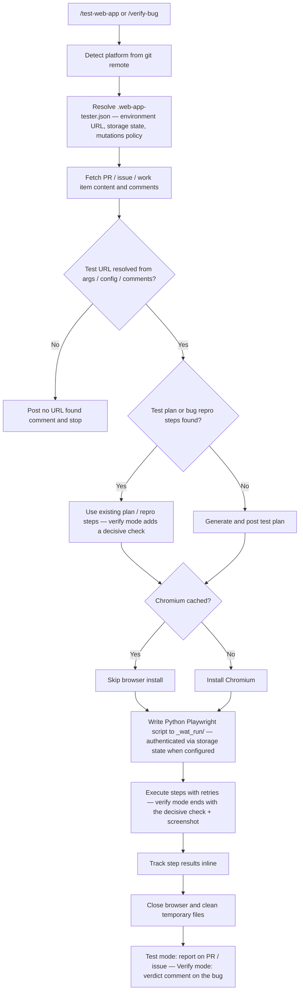

The **Web App Tester** plugin validates web app behavior for a GitHub or Azure DevOps pull request, issue, or work item by running browser-based checks with **Playwright** in headless Chromium. It can run **authenticated** (via Playwright storage states), target **named environments** from a project config file, and — since v1.1 — **re-verify reported bugs** and post a verdict on the bug itself.

Two commands:

| Command | What it does |
| --- | --- |
| **`/test-web-app`** | Runs a test plan against the resolved URL and posts a test execution report (`PASSED` / `FAILED` / `BLOCKED`) |
| **`/verify-bug`** | Replays a bug's repro steps, runs a decisive check against the expected result, and posts a **STILL REPRODUCIBLE / NOT REPRODUCIBLE / INCONCLUSIVE** verdict comment on the bug |

Both run the same three phases:

| Phase | What it does |
| --- | --- |
| **Gather context** | Detects the platform, resolves the environment and auth from `.web-app-tester.json`, fetches PR/issue/work item content, finds the test URL, and retrieves or derives a test/verification plan |
| **Run Playwright** | Opens a headless session (pre-authenticated when a storage state is configured), executes steps with retries, and captures screenshots — verify mode ends with a decisive check and screenshot |
| **Post report** | Computes the verdict and posts a structured report — test mode on the PR/issue, verify mode on the bug itself |

Works with **GitHub** and **Azure DevOps**.

---

## How It Works



1. **Detect platform** — reads `git remote get-url origin` to determine GitHub or Azure DevOps and routes all fetch/post operations to the correct provider.
2. **Resolve project config** — reads `.web-app-tester.json` from the consumer repo root when present: named environment URLs, per-environment `mutationsAllowed` policy, role → storage-state mappings, and an `authSetupCommand`. The file is optional — without it, behavior is identical to 1.0.
3. **Gather context** — reads PR/issue/work item title, body, comments, and linked references. For Azure DevOps `wi` entry: extracts bug repro steps as the test plan seed and discovers the linked PR for URL lookup and report posting. In verify mode, the work item must be of type `Bug`, and bugs that are not browser-verifiable (backend-only, API-only, build/tooling) are triaged out before any browser launches.
4. **Resolve the test URL** — by precedence: `--url` argument → `--env` argument → `defaultEnvironment` from config → comment-scraping (for example `Preview URL:` or `Staging URL:`). If nothing resolves, it posts a comment and stops.
5. **Find or derive the plan** — test mode: uses an existing structured plan from comments (including plans generated by `test-strategist`), or generates one from context and posts it first; for ADO Bugs, repro steps are used directly as the plan if they contain structured action verbs. Verify mode: normalizes the repro steps into a step plan and derives a **decisive check** — `BUG_SIGNAL` (what the reporter observed) vs `FIXED_SIGNAL` (the expected result).
6. **Prepare Playwright** — reuses cached Chromium if available; installs once when needed.
7. **Execute steps** — writes an instrumented Python/Playwright script (pre-authenticated via `storage_state` when configured), executes it in a single `python3` call, and parses structured `STEP_RESULT|...` log lines; failures are self-verified against captured screenshots, with retry logic for transient failures. Verify mode implements the decisive check as an explicit final step and always captures a decisive screenshot.
8. **Publish report** — test mode: posts one structured test execution report back to the PR, issue, or work item (for ADO `wi` entry with a linked PR: full report on the PR thread plus a brief notification on the work item). Verify mode: posts one verdict comment **on the bug itself**, with the decisive screenshot attached on Azure DevOps.

---

## Inputs

| Input | Source | Required | Description |
| --- | --- | --- | --- |
| Target ID | Command argument | Yes | GitHub: PR number (`pr 42`) or issue number (`issue 88`). Azure DevOps: PR number (`pr 42`) or work item ID (`wi 1234`). `/verify-bug` accepts `wi` (Bug work items) and `issue` only |
| Test URL | `--url`/`--env` arguments, `.web-app-tester.json`, or PR/issue/work item content | Yes | Resolved by precedence: `--url` → `--env` → `defaultEnvironment` → comment-scraping |
| Test plan | PR/issue/work item content | No | Numbered or bulleted verification steps; generated if missing. For ADO Bugs, repro steps are used as the seed |
| Auth / read-only policy | `.web-app-tester.json` | No | Role → storage-state mappings, `mutationsAllowed`, `authSetupCommand` — see [Configuration File](#configuration-file-web-app-testerjson) |

The platform is auto-detected from the git remote URL — no configuration needed.

### Optional arguments (both commands)

| Flag | Meaning |
| --- | --- |
| `--env <name>` | Run against the named environment from `.web-app-tester.json` |
| `--url <url>` | Run against this URL directly |
| `--role <role>` | Authenticate with this role's storage state from the environment config |
| `--interactive` | Pause for plan confirmation before the browser opens and for comment approval before posting |

---

## Sample Prompts

**Test a GitHub PR:**

```text
/test-web-app pr 42
```

**Test a GitHub issue:**

```text
/test-web-app issue 88
```

**Test an Azure DevOps PR:**

```text
/test-web-app pr 42
```
*(The plugin auto-detects Azure DevOps from the git remote — same command, different platform.)*

**Test an Azure DevOps Bug (work item):**

```text
/test-web-app wi 1234
```
*(Extracts repro steps as the test plan, finds the linked PR for the deployment URL, posts the full report on the PR and a notification on the bug.)*

**Infer PR from current branch context:**

```text
/test-web-app
```

**Test against a named environment as a specific role:**

```text
/test-web-app wi 1234 --env staging --role admin
```

**Re-verify a bug on Azure DevOps:**

```text
/verify-bug wi 1234 --env staging
```

**Re-verify a GitHub issue:**

```text
/verify-bug issue 88 --url https://staging.example.com
```

---

## Configuration File (`.web-app-tester.json`)

A consumer repo may place `.web-app-tester.json` at its root. The file is **optional** — without it the plugin scrapes the URL from comments and runs unauthenticated, exactly as 1.0.

```json
{
  "defaultEnvironment": "staging",
  "environments": {
    "staging": {
      "baseUrl": "https://staging.example.com",
      "mutationsAllowed": true,
      "storageStates": { "admin": "tests/e2e/.auth/admin.json", "user": "tests/e2e/.auth/user.json" },
      "defaultRole": "admin"
    },
    "prod": { "baseUrl": "https://app.example.com", "mutationsAllowed": false }
  },
  "authSetupCommand": "npm --prefix tests/e2e run auth:refresh"
}
```

| Field | Required | Meaning |
| --- | --- | --- |
| `environments.<name>.baseUrl` | Yes | Base URL for the environment |
| `environments.<name>.mutationsAllowed` | No (default `false`) | `false` = read-only mode for this environment — data-modifying steps are skipped |
| `environments.<name>.storageStates` | No | Map of role → Playwright storage-state file path (relative to repo root) |
| `environments.<name>.defaultRole` | No | Role used when the run doesn't demand one via `--role` |
| `defaultEnvironment` | No | Environment used when no `--env`/`--url` argument is given |
| `authSetupCommand` | No | Command run (at most once per run, from the repo root) to regenerate storage states when missing or rejected |

When the URL comes from config, `mutationsAllowed` is **authoritative** for read-only enforcement; the URL substring heuristic (`staging`, `preview`, …) applies only to scraped or `--url` URLs.

:::caution
Storage-state files contain live session cookies — **gitignore them** in the consumer repo. Credentials never go in `.web-app-tester.json` (paths and URLs only), and the plugin never prints storage-state contents to logs, comments, or generated scripts.
:::

---

## Authenticated Testing

When the resolved environment defines `storageStates`, the browser context starts pre-authenticated via Playwright's `storage_state` for the requested role. The auth-gate handling is a three-rung ladder:

1. **No storage state configured** → 1.0 behavior: gated steps are marked BLOCKED (`Auth gate detected — no credentials provided`).
2. **Storage state configured but the app still shows a login page** → if an `authSetupCommand` is configured and hasn't run yet this session, the plugin runs it once, regenerates the context, and retries.
3. **Still gated** → steps are BLOCKED with `Auth session rejected — storage state stale and setup command did not recover it`.

The natural storage-state generator is your repo's existing E2E global-setup — the script that logs each test role in and saves its session via `context.storage_state(path=...)`.

---

## Bug Verification Mode (`/verify-bug`)

`/verify-bug <wi <id> | issue <n>>` re-verifies a reported bug against a deployed environment and posts a verdict **on the bug itself**. ADO work items must be of type `Bug`; `pr` is not a valid verify target.

The verification plan is derived from the bug's repro steps plus a **decisive check** — the single observation that discriminates the verdicts: `BUG_SIGNAL` (the actual result the reporter observed) vs `FIXED_SIGNAL` (the expected result, which must be **positively observed**).

| Verdict | Meaning |
| --- | --- |
| ❌ **STILL REPRODUCIBLE** | The decisive check observed the bug's reported behavior |
| ✅ **NOT REPRODUCIBLE — appears fixed** | All steps executed and the expected result was positively observed |
| ⚪ **INCONCLUSIVE** | Anything else — blocked step, auth/environment failure, missing precondition, or neither signal observed |

:::note
**A blocked run is never reported as fixed.** A bug's repro steps are an unhappy path — the plan "not failing" proves nothing. Any step blocked on the path to the decisive check yields INCONCLUSIVE, and the wording is always qualified ("appears fixed"), never an unqualified "fixed".
:::

Evidence: on Azure DevOps the decisive screenshot is uploaded via the attachments API and embedded in the verdict comment; on GitHub the decisive observation is described inline (comments don't support attachments via the CLI). Bugs that aren't browser-verifiable (backend-only, API-only, build/tooling) are triaged out before any browser launches, with a brief note posted on the bug.

---

## Interactive vs Autonomous

| Mode | Behavior |
| --- | --- |
| **Autonomous** (default, always on the Xianix executor) | Never pauses; INCONCLUSIVE verify runs post a brief neutral note so the run isn't silent; work item state is **never** changed |
| **Interactive** (`--interactive`, or an interactive Claude Code session) | Pauses at **Gate A** — plan confirmation before any browser opens (verify mode: including the decisive check, preconditions, and mutating steps) — and **Gate B** — draft-comment approval before posting. In verify mode, the matching work item state transition is offered after posting and applied only on a second explicit yes |

---

## Environment Variables

The Xianix Agent reads these from its secrets store and injects them at runtime via the rule's `with-envs` block. For local CLI use, export them in your shell.

| Variable | Platform | Required | Purpose |
| --- | --- | --- | --- |
| `GITHUB-TOKEN` | GitHub | Yes | Authenticate `gh` CLI for fetching PR/issue data and posting comments |
| `AZURE-DEVOPS-TOKEN` | Azure DevOps | Yes | PAT for the ADO REST API — reading PRs/work items and posting comments |
| `ENVIRONMENT` | Both | No | Set to `production` to enable read-only mode — all state-changing steps are skipped and marked BLOCKED |

### GitHub Token Permissions

| Permission | Access | Why it's needed |
| --- | --- | --- |
| **Contents** | Read | Access repository contents |
| **Metadata** | Read | Search repositories and access repository metadata |
| **Pull requests** | Read & Write | Fetch pull request context and post test execution reports |
| **Issues** | Read & Write | Fetch issue context and post test execution reports |

### Azure DevOps PAT Permissions

Create the token in **User Settings → Personal access tokens** with the following scopes:

| Scope | Access | Why it's needed |
| --- | --- | --- |
| **Work Items** | Read & Write | Fetch bug repro steps and acceptance criteria; post notification comments on work items. Verify mode also needs Write to post the verdict comment, upload screenshot attachments, and (interactive only) apply a confirmed state transition |
| **Code** | Read | Access PR metadata, threads, and linked work items |
| **Pull Requests** | Read & Write | Fetch PR content and post the test execution report |

---

## Execution Statuses

| Status | Meaning |
| --- | --- |
| PASSED | Step executed and expected outcome observed |
| FAILED | Step executed but expected outcome not observed |
| BLOCKED | Step could not execute after retries, was skipped because the environment is read-only (`mutationsAllowed: false` or `ENVIRONMENT=production`), or was halted by an auth gate that storage-state auth could not clear |

Overall result (test mode) is:

- **PASSED** when all steps pass
- **FAILED** when one or more steps fail
- **BLOCKED** when any step cannot be safely or reliably executed

Verify mode uses its own verdict vocabulary instead — see [Bug Verification Mode](#bug-verification-mode-verify-bug).

---

## Safety Rules

- If no test URL is found, the plugin posts a comment and exits.
- Set `ENVIRONMENT=production` to switch to **read-only mode**, which skips all state-changing actions (destructive test cases are marked BLOCKED).
- An environment with `mutationsAllowed: false` in `.web-app-tester.json` is **authoritatively read-only** — mutating steps are skipped with `Skipped — environment is read-only`, regardless of the URL.
- **Blocked never means fixed** — in verify mode, any step blocked on the path to the decisive check yields INCONCLUSIVE, never "appears fixed".
- Work item state transitions are **never performed autonomously** — offered only in interactive verify runs, applied only on a second explicit yes.
- Credentials and tokens are never posted in comments; storage-state contents (cookies, tokens) never appear in logs, comments, or generated scripts — only file paths.
- Temporary files (the `_wat_run/` working directory) are deleted after every run, even if execution fails; in verify mode, deletion waits until the screenshot evidence has been uploaded.

---

## Report Output

The plugin posts one comment with:

- URL tested
- total step count
- per-step status table
- overall result
- failure or blocked step details (with captured screenshot reference when available)

This keeps the output concise and immediately reviewable inside the PR, issue, or work item timeline.

---

## Quick Start

```bash
# Point Claude Code at the plugin
claude --plugin-dir /path/to/xianix-plugins-official/plugins/web-app-tester

# Then in chat
/test-web-app pr 42

# Or re-verify a bug
/verify-bug wi 1234 --env staging
```

Or trigger it automatically via the Xianix Agent by adding a rule — see the examples below and the [Rules Configuration](/agent-configuration/rules/) guide.

For setup details (Python 3.10+, Playwright Python package, `gh` CLI, and Azure DevOps PAT), see the plugin setup guide in the repository:

<https://github.com/xianix-team/plugins-official/tree/main/plugins/web-app-tester/docs/setup.md>

---

## Rule Examples

Add the execution block below to your `rules.json` so the Xianix Agent automatically tests web apps when a webhook fires.

### When does the agent trigger?

The Web App Tester is mainly **tag-driven**. It runs when the `ai-dlc/pr/test-web-app` label is present on a pull request and one of the scenarios below fires (OR logic across `match-any` entries).

| Scenario | What it covers |
| --- | --- |
| PR opened / created with the tag already present | A PR is opened with the tag included from the start |
| New commits pushed to a tagged PR | The PR source branch is updated while the tag is still on the PR |
| Tag newly applied to a PR | A human (or another rule) adds `ai-dlc/pr/test-web-app` to an open PR |

| Platform | Scenario | Webhook event | Filter rule |
| --- | --- | --- | --- |
| GitHub | Tag newly applied | `pull_request` | `action==labeled` and `label.name=='ai-dlc/pr/test-web-app'` |
| GitHub | PR opened with tag | `pull_request` | `action==opened` and `ai-dlc/pr/test-web-app` is in `pull_request.labels` |
| GitHub | New commits to tagged PR | `pull_request` | `action==synchronize` and `ai-dlc/pr/test-web-app` is in `pull_request.labels` |

### Execution-block shape

Each execution block in `rules.json` follows this top-level shape:

| Field | Purpose |
| --- | --- |
| `name` | Human-readable id for the execution |
| `platform` | `"github"` or `"azure-devops"` — drives which provider the plugin uses |
| `repository.url` | Webhook path to the repository URL (e.g. `repository.clone_url`) |
| `repository.ref` | Webhook path to the branch ref (e.g. `pull_request.head.ref`) |
| `match-any` | Array of trigger filters — first one to match wins |
| `use-inputs` | **Minimal** — usually just the entry-point id (e.g. `pr-number`). The repository URL and ref are injected automatically from the `repository` block. |
| `use-plugins` | The plugin to invoke |
| `with-envs` | Required environment variables, sourced from the agent's `secrets.*` store and marked `mandatory: true` |
| `execute-prompt` | The prompt sent to the agent. Implicit interpolations: `{{repository-name}}` and `{{git-ref}}` from the `repository` block, plus any `name` from `use-inputs` |

### GitHub

```json
{
  "name": "github-web-app-test",
  "platform": "github",
  "repository": {
    "url": "repository.clone_url",
    "ref": "pull_request.head.ref"
  },
  "match-any": [
    {
      "name": "github-pr-tag-applied",
      "rule": "action==labeled&&label.name=='ai-dlc/pr/test-web-app'"
    }
  ],
  "use-inputs": [
    { "name": "pr-number", "value": "pull_request.number" }
  ],
  "use-plugins": [
    {
      "plugin-name": "web-app-tester@xianix-plugins-official",
      "marketplace": "xianix-team/plugins-official"
    }
  ],
  "with-envs": [
    { "name": "GITHUB-TOKEN", "value": "secrets.GITHUB-TOKEN", "mandatory": true }
  ],
  "execute-prompt": "You are testing pull request {{pr-number}}. Run /test-web-app pr {{pr-number}} to perform the automated web app test."
}
```

### Azure DevOps

```json
{
  "name": "ado-web-app-test",
  "platform": "azure-devops",
  "repository": {
    "url": "resource.url",
    "ref": "resource.targetRefName"
  },
  "match-any": [
    {
      "name": "ado-pr-tag-applied",
      "rule": "eventType==git.pullrequest.updated&&resource.status=='active'"
    }
  ],
  "use-inputs": [
    { "name": "pr-number", "value": "resource.pullRequestId" }
  ],
  "use-plugins": [
    {
      "plugin-name": "web-app-tester@xianix-plugins-official",
      "marketplace": "xianix-team/plugins-official"
    }
  ],
  "with-envs": [
    { "name": "AZURE-DEVOPS-TOKEN", "value": "secrets.AZURE-DEVOPS-TOKEN", "mandatory": true }
  ],
  "execute-prompt": "You are testing pull request {{pr-number}}. Run /test-web-app pr {{pr-number}} to perform the automated web app test."
}
```

:::note
These blocks go inside the `executions` array of a rule set. See [Rules Configuration](/agent-configuration/rules/) for the full file structure and filter syntax.
:::

### Triggering bug verification

`/verify-bug` is invoked the same way — swap the `execute-prompt` (and the trigger to a work-item or issue event). For example, a rule that fires when a bug moves to a "ready to verify" state can use:

```text
You are verifying bug {{wi-id}}. Run /verify-bug wi {{wi-id}} --env staging to re-verify it and post the verdict on the bug.
```

Autonomous runs never change work item state — the verdict comment is the only output.

---

## What Is Included

| Path | Purpose |
| --- | --- |
| `commands/test-web-app.md` | Entry command and argument pattern (`--env`, `--url`, `--role`, `--interactive`) |
| `commands/verify-bug.md` | Bug re-verification entry command (`MODE=verify`) |
| `agents/orchestrator.md` | End-to-end orchestration flow — config resolution, mode dispatch, interactive gates |
| `skills/post-verdict-report/SKILL.md` | Verify-mode verdict computation and posting (blocked-never-means-fixed rules) |
| `providers/github.md` | GitHub fetch/post operations via `gh` CLI |
| `providers/azure-devops.md` | Azure DevOps fetch/post operations via REST API — including attachments, verdict comment, and state update |
| `styles/report-template.md` | Strict test-report format |
| `styles/verdict-template.md` | Strict bug-verification comment format |
| `hooks/validate-prerequisites.sh` | Python 3.10+, `playwright` Python package, platform CLI checks, and `.web-app-tester.json` validation |
| `docs/setup.md` | Installation and auth setup |
| `docs/configuration.md` | `.web-app-tester.json` schema, storage states, and `authSetupCommand` contract |
